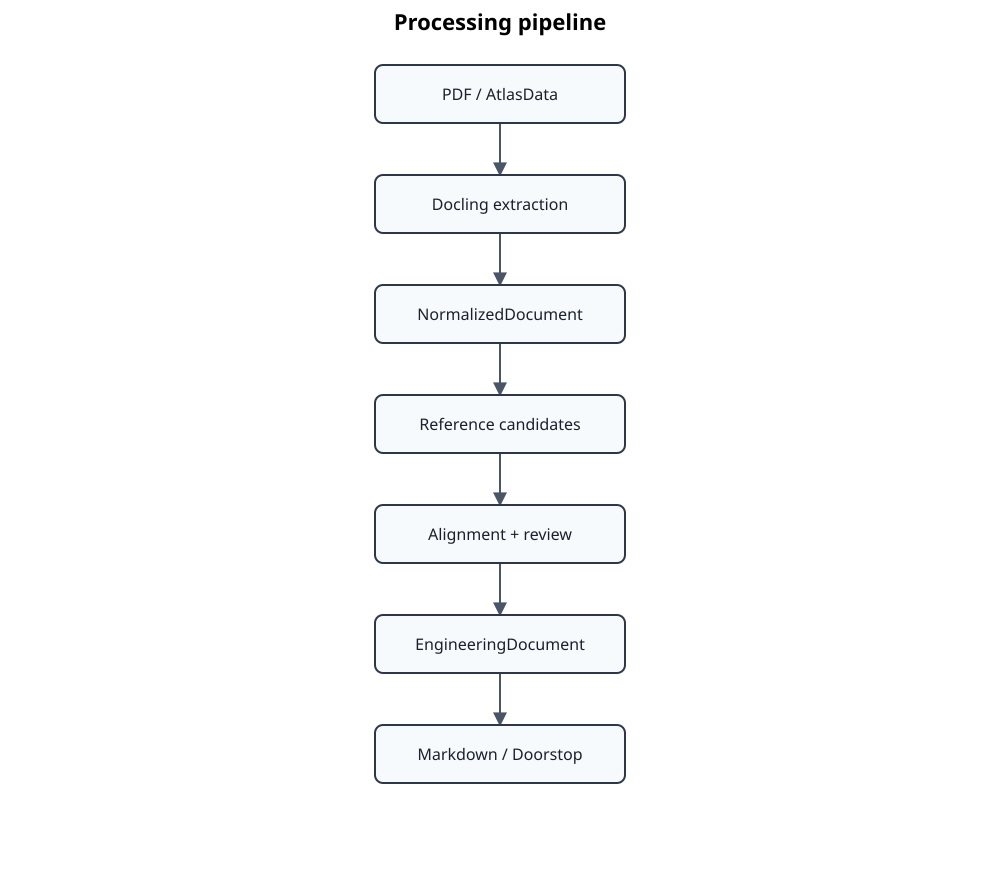

<div align="center">

# Standards Atlas

### Structured, traceable document engineering for international standards

**Import · Normalize · Align · Evaluate · Serve · Publish**

[Documentation](docs/README.md) · [Getting started](docs/getting-started/README.md) · [Architecture](docs/architecture/README.md) · [CLI reference](docs/reference/cli-reference.md) · [Architecture decisions](docs/architecture/adr/README.md)

</div>



Standards Atlas transforms standards, technical specifications, and other highly structured technical texts into a **traceable, machine-processable engineering knowledge base**. Source documents are preserved as canonical **EngineeringDocuments** and enriched through deterministic structural processing and qualified semantic analysis.

The project is deliberately use-case open. Doorstop traceability, cross-standard relationship heatmaps, conversational exploration, and MCP integrations are applications of the knowledge base rather than hard-coded purposes of Standards Atlas.

Structure and domain knowledge are modeled separately. Deterministically derived taxonomy, abstract semantic functions, Knowledge Domain, source identity, provenance, and qualification evidence form an explicit **context layer (CBox)**. Domain-specific **OWL TBoxes** define the concepts and relations used to derive clause-level **ABox** assertions. Every derived semantic assertion must remain traceable through its extraction and qualification evidence to the originating clause and source document.

LLMs are qualified analysis components for semantic tasks that cannot be derived reliably by deterministic processing or pattern matching; they are not the canonical model or the architectural center of the system. Other analysis techniques may implement the same semantic contracts. OWL projections are likewise derived knowledge representations: `EngineeringDocument` remains the canonical document model.

The resulting knowledge base can be indexed through lexical, vector, RAG, or GraphRAG mechanisms and exposed through chat, MCP, graph queries, or future interfaces. Retrieval indexes and application projections remain rebuildable consumers of the canonical documents and formal knowledge. Licensed source content remains protected throughout this process.

## Why Standards Atlas?

| Capability | What it provides |
|---|---|
| **Catalog-driven onboarding** | Reproducible configuration for single-part and multi-part standards, editions, source files, page selection, and relationships. |
| **Document extraction and normalization** | Docling-based PDF extraction followed by deterministic structural normalization into stable domain contracts, including source-derived visual preservation for formulas that cannot yet be transcribed semantically. |
| **Reference detection and alignment** | Candidate detection, automatic matching against AtlasData baselines, confidence information, and a human review gate. |
| **Traceable engineering documents** | Canonical documents, content blocks, transformation evidence, source lineage, and durable workspace artefacts. |
| **Structural taxonomy** | Deterministic hierarchy, topic, lifecycle, sequence, contextual-node, and structural-reference evidence materialized before semantic interpretation. |
| **Semantic ontology** | Qualified LLM classification of modular ontology dimensions using clause content plus explicit structural context. |
| **Semantic evaluation** | Reproducible local corpora, versioned prompt/model matrices, protected-content-safe reports, and regression evidence. |
| **MCP access** | Read-only clause tools and resources over stdio or secured Streamable HTTP, with an automated compatibility probe. |
| **Reusable publications** | Markdown and Doorstop outputs generated from canonical models rather than treated as internal source formats. |

## Quick start

```bash
uv sync --dev
uv run standards-atlas --help
```

Inspect and execute a catalog-driven document workflow:

```bash
uv run standards-atlas workflow plan \
  --manifests manifests/standards.yaml \
  --all
uv run standards-atlas workflow run \
  --manifests manifests/standards.yaml \
  --all
```

Run the local semantic-evaluation and MCP entry points:

```bash
uv run standards-atlas evaluation --help
uv run standards-atlas mcp --help
```

The workflow intentionally stops at review boundaries when human confirmation is required. See the [getting-started path](docs/getting-started/README.md), the [document workflow](docs/user-guide/document-workflow.md), and the [MCP server guide](docs/user-guide/mcp-server.md) for operational details.

## Documentation

| Area | Start here |
|---|---|
| **First use and guided learning** | [Getting started](docs/getting-started/README.md) · [Tutorials](docs/tutorials/README.md) |
| **Operational tasks** | [User guide](docs/user-guide/README.md) |
| **Architecture and decisions** | [Architecture](docs/architecture/README.md) · [ADR index](docs/architecture/adr/README.md) |
| **Development and qualification** | [Development guide](docs/development/README.md) |
| **Commands, formats, and vocabulary** | [Reference](docs/reference/README.md) |
| **Current and planned direction** | [Project direction](docs/roadmap/README.md) |

## Design principles

- **Traceability before convenience** — every derived artefact should explain where it came from.
- **Review uncertainty explicitly** — automated alignment and semantic analysis may propose; people approve engineering meaning.
- **Keep source content private** — licensed document text remains local unless publication is explicitly permitted.
- **Use canonical domain models** — PDF, AtlasData, Markdown, Doorstop, and MCP are adapters or exchange surfaces.
- **Prefer deterministic transformations** — reproducibility is a prerequisite for qualification and regression testing.
- **Separate context from domain knowledge** — document structure and semantic function form explicit interpretation context; domain assertions remain a separate formal projection.
- **Qualify semantic inference** — LLMs and other probabilistic analyzers implement qualified semantic contracts rather than defining the canonical model.
- **Keep knowledge evidence-backed** — every formal assertion must remain traceable to source content, extraction provenance, and qualification evidence.
- **Treat retrieval as a serving layer** — RAG, GraphRAG, graph queries, chat, and MCP consume rebuildable projections rather than becoming canonical storage.
- **Separate application behavior from protocols** — evaluation services remain reusable independently of MCP.

## Project status

Standards Atlas 0.8.5 is an evolving pre-alpha engineering platform. The deterministic document pipeline, local semantic-evaluation workflow, and read-only MCP access are operational. Generated artefacts and model-assisted results are not authoritative standards content and must be reviewed before being used as engineering evidence.

## Development

```bash
uv run pytest
uv run ruff check .
```

Standards Atlas is licensed under the LGPL Version 3.


## Codex access

Codex can consume the read-only Standards Atlas MCP interface without storing
the bearer token in project files:

```bash
uv run standards-atlas mcp codex-config \
  --url http://127.0.0.1:8765/mcp/
```

See `docs/user-guide/codex-integration.md` for setup and verification.


## Current version

This snapshot corresponds to **standards-atlas 0.8.5**. Version 0.8.5 builds on the completed application-package refactoring with auditable qualification-run archives, typed workflow manifests, deterministic structural-taxonomy context, qualified production ontology classification, dimension-aware cascade resolution, visual-formula preservation and transcription enrichment, and optional LLM-assisted normalization-quality qualification.

### Formula transcription enrichment

Visual-only formulas preserved during PDF normalization can be exposed to trusted MCP clients for LaTeX transcription. Submissions are stored as provenance-bearing enrichment artifacts and then deterministically applied to the canonical formula block; MCP writes require the explicit `capabilities.formula_transcription` opt-in.
