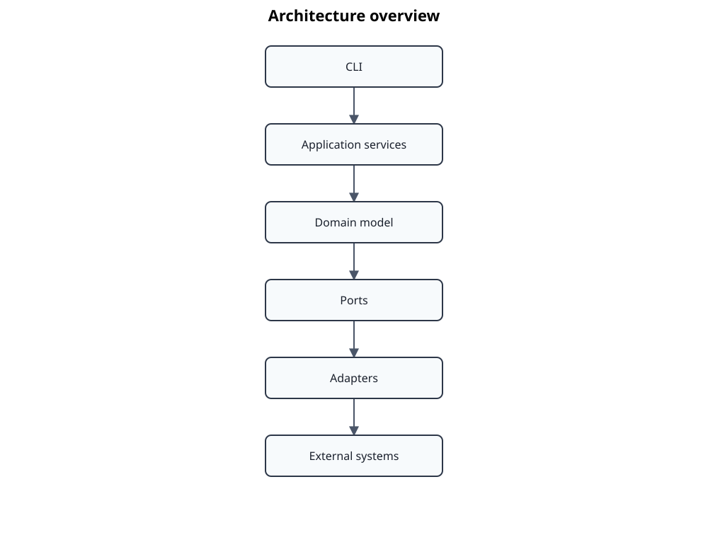

# Architecture

Standards Atlas is a traceability-centered platform for transforming controlled source publications into canonical, reviewable engineering knowledge. The implementation follows a hexagonal architecture, uses deterministic transformation stages, and preserves evidence and lineage across persisted artifacts.



The overview is deliberately compact. It shows the governing dependency and data-flow concepts, not every application service or adapter described below. The [overall UML component architecture](diagrams/svg/overall-component-architecture.svg) and the [current UML class diagram](diagrams/svg/current-architecture-class-diagram.svg) provide the broadest implementation-oriented views; the topic documents remain authoritative for omitted details.

## Architecture map

| Concern | Document |
|---|---|
| System boundary, actors, and external systems | [System context](system-context.md) |
| Major deployable and logical building blocks | [Component model](component-model.md) |
| Canonical entities and classification models | [Domain model](domain-model.md) |
| Dependency direction and composition roots | [Ports and adapters](ports-and-adapters.md) |
| Extraction, normalization, alignment, and publication | [Processing pipeline](processing-pipeline.md) |
| Planning, execution, recovery, and review gates | [Workflow orchestration](workflow-orchestration.md) |
| Persisted contracts, invalidation, and provenance | [Persistence and lineage](persistence-and-lineage.md) |
| Compatibility, migration, regeneration, and deprecation | [Evolution and compatibility](evolution-and-compatibility.md) |
| Generic evaluation and semantic qualification | [Evaluation architecture](evaluation-services.md) |
| Structural profiles and semantic classification | [Structural classification](structural-classification.md) |
| Addressable tables, records, and portable relations | [Table semantics](table-semantics.md) |
| LLM gateways and managed local runtimes | [LLM integration](llm-integration.md) |
| Target architecture for cross-document relationships | [Relationship mapping](relationship-mapping.md) |
| MCP service boundary and remote deployment | [MCP clause server](mcp-clause-server.md) |
| Runtime processes and trust boundaries | [Runtime and deployment](runtime-and-deployment.md) |
| Doorstop family projection | [Doorstop document hierarchy](doorstop-document-hierarchy.md) |
| Methods and techniques extraction | [Methods and techniques](methods-and-techniques.md) |
| Publication and licensed-content boundaries | [Security and copyright](security-and-copyright.md) |

## Current architectural baseline

The canonical domain aggregate is `EngineeringDocument`, composed of structured `Clause` objects. Visual-only formulas remain typed `FormulaBlock` values and may carry source-derived PNG assets until a later semantic transcription is available. Structured tables remain canonical clause content and can be projected deterministically into addressable knowledge tables and records. A clause owns structured content blocks, source evidence, a multi-dimensional `StructuralProfile`, optional semantic classification, annotations, and relations. External representations such as Docling JSON, AtlasData, Markdown, and Doorstop are adapters or projections; none is the internal source of truth.

The application layer is organized around use cases and explicit ports. Important subsystems are workflow orchestration, normalization, alignment, document construction, publication, generic evaluation, and semantic qualification. The CLI is the primary composition root. MCP is an additional read-only inbound adapter. Filesystem, Docling, source-PDF formula rendering, AtlasData, Markdown, Doorstop, LLM, and MCP integrations live in the adapter layer.

The intended dependency direction is:

```text
CLI / MCP / future inbound adapters
                |
                v
       application use cases
                |
                v
          domain model

outbound adapters implement application ports
```

## Architectural invariants

- Domain code does not import application, CLI, persistence, Docling, Doorstop, or protocol packages.
- Application services receive infrastructure through ports rather than constructing adapters.
- The CLI and process launchers are composition roots.
- Every persisted stage has an explicit contract and deterministic identity where practical.
- Human review is a first-class gate, not an implicit correction inside adapters.
- Protected standards and evaluation corpora remain below `local/` or another explicitly configured private root.
- LLM output is proposal data until it passes qualification or human review.
- Relationship extraction extends the canonical model; it does not replace source evidence.

## Diagram scope

Architecture diagrams in this documentation are views selected for a specific question. They omit secondary services, compatibility re-exports, individual persistence artifacts, configuration models, and operational edge cases where including them would obscure the main relationships. Such omissions do not imply that the element is architecturally irrelevant or absent from the implementation. Each topic document explains the intended scope of its embedded diagram.

## Design records and diagrams

- [Architecture Decision Records](adr/README.md)
- [Diagram catalog](diagrams/README.md)
- [Architecture principles](principles.md)

## Related documentation

- [Core concepts](../user-guide/concepts.md)
- [Workspace guide](../user-guide/workspace.md)
- [Artifact formats](../reference/artifact-formats.md)
- [Developer guide](../development/README.md)
- [Documentation home](../README.md)
