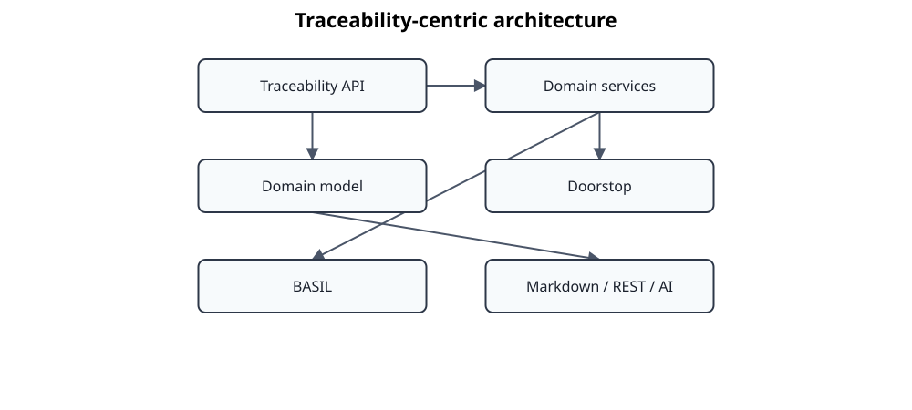

# ADR 0002: Adopt a Traceability-Centric Architecture

## Status

**Accepted**

## Context

Standards Atlas originated as a collection of tools for importing, transforming, and exporting technical standards.

Over time, the project's scope expanded significantly. It now supports semantic analysis, cross-standard mappings, knowledge domains, relationship discovery, and AI-assisted processing.

Initially, the project architecture evolved around individual tools such as Doorstop, Markdown processing, IntelliDoc, and various conversion scripts. While this approach enabled rapid development, it also introduced tight coupling between the domain model and specific technologies.

As additional integrations are planned—including BASIL, REST APIs, graph databases, AI services, and web applications—the project requires a stable architectural center that is independent of any individual tool or file format.

## Decision

Standards Atlas adopts a **traceability-centric architecture**.

The core responsibility of the system is to represent, manage, and expose traceability information between engineering artifacts.

Every supported technology—including Doorstop, BASIL, Markdown, CSV, graph databases, AI services, and future integrations—is treated as an adapter around a common traceability model.

The architectural center of the project is therefore the **Traceability API**, which provides technology-independent access to the semantic relationships managed by Standards Atlas.

The overall architecture is organized as follows:

## Rationale

Traceability is the fundamental capability shared by all supported workflows.

Regardless of whether information originates from standards documents, requirements management tools, testing frameworks, or AI-assisted analysis, the essential question remains:

* What is related?
* Why is it related?
* How strong is the relationship?
* Where does the relationship originate?
* How can the relationship be verified?

By placing traceability at the architectural center, Standards Atlas becomes independent of specific document formats and external tools.

This allows new integrations to be implemented without modifying the core domain model.

## Domain Model

The Traceability API is built around a technology-independent domain model.

Typical domain entities include:

* Standard
* Document
* Clause
* Requirement
* Concept
* Relationship
* TraceLink
* Evidence
* TestCase
* Artifact
* KnowledgeDomain

These entities represent engineering knowledge rather than implementation details.

## Architectural Principles

The following principles guide future development:

### Technology Independence

The domain model must not depend on Doorstop, BASIL, Markdown, graph databases, or AI frameworks.

### Adapter Pattern

All external systems communicate with the core through adapters.

Adapters are responsible for translating between external representations and the internal domain model.

### Stable Domain Model

The domain model should evolve much more slowly than integrations.

External technologies may change over time without requiring modifications to the core architecture.

### Single Source of Truth

Traceability information is maintained within the core model.

Exports to Doorstop, BASIL, reports, or graph databases are derived representations.

### Semantic First

The project models engineering concepts and their relationships rather than documents or file structures.

Documents are one representation of engineering knowledge, not the knowledge itself.

## Consequences

### Positive

* Clear separation between domain logic and infrastructure.
* New integrations can be added with minimal impact.
* Multiple tools can share the same semantic model.
* AI components become consumers of the traceability model rather than owners of engineering knowledge.
* Traceability becomes a reusable platform capability.

### Negative

* The initial architecture is more abstract than a collection of scripts.
* Adapter implementations require additional design effort.
* Some existing scripts will need to be refactored before they fit naturally into the new architecture.

## Alternatives Considered

### Doorstop-Centric Architecture

Doorstop could have been adopted as the primary data model.

This was rejected because Doorstop is a requirements management tool rather than a semantic engineering knowledge model.

### BASIL-Centric Architecture

BASIL provides collaborative traceability and test management.

It was not selected as the architectural center because Standards Atlas aims to remain independent of any specific requirements management platform.

### Document-Centric Architecture

Standards Atlas could continue to model documents as the primary entities.

This approach was rejected because semantic relationships frequently span multiple documents, standards, and engineering domains.

## Future Directions

The Traceability API is expected to become the primary integration point for:

* Doorstop
* BASIL
* REST services
* Graph databases
* AI assistants
* Knowledge graph exploration
* Compliance reporting
* Future engineering tools

The long-term vision is for Standards Atlas to provide a shared semantic traceability platform for engineering standards rather than a collection of document processing utilities.

## Decision Date

2026-07-07

