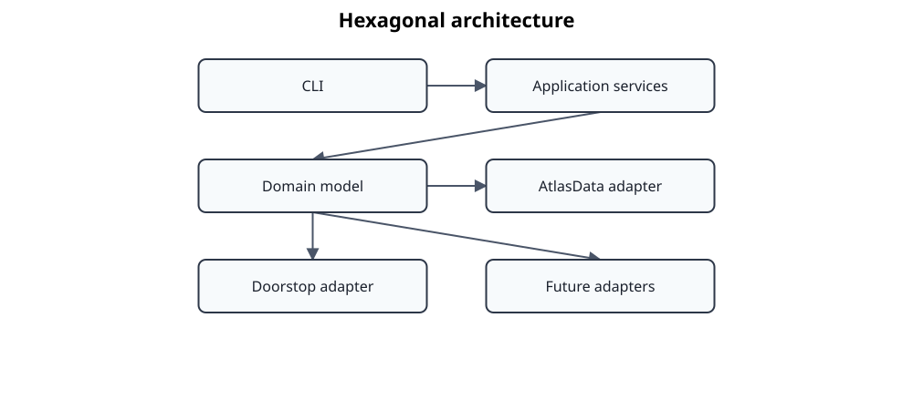

# ADR 0003 – Adopt a Hexagonal Architecture

## Status

Accepted

## Context

Standards Atlas is evolving from a collection of scripts into a reusable engineering knowledge platform.

The project integrates information from multiple heterogeneous sources, including:

* Atlas data files
* Doorstop
* BASIL
* Markdown
* future REST services
* graph databases
* AI-assisted analysis

Historically, much of the project logic was tightly coupled to the Atlas data format. As new integrations are added, this coupling would make the system increasingly difficult to maintain and evolve.

At the same time, the long-term vision of Standards Atlas is to provide a technology-independent semantic model for engineering standards and traceability.

The architecture therefore needs to separate engineering knowledge from implementation details.

## Decision

Standards Atlas adopts a **Hexagonal Architecture (Ports and Adapters)**.

The domain model becomes the center of the system.

All external technologies communicate with the domain exclusively through adapters and application services.

The domain model must remain independent of:

* document formats,
* storage technologies,
* command-line interfaces,
* web frameworks,
* AI frameworks,
* external tools.

## Architecture



The Domain Model represents engineering knowledge.

Adapters translate between external representations and the canonical domain model.

Application Services coordinate workflows and expose the public behaviour of the system.

## Responsibilities

### Domain

The domain contains technology-independent engineering concepts.

Examples include:

* Standard
* Clause
* Requirement
* Relationship
* Concept
* Knowledge Domain

The domain must not depend on any adapter or infrastructure component.

### Application

The application layer implements use cases.

Examples include:

* loading standards,
* performing traceability analysis,
* comparing standards,
* validating mappings,
* exporting information.

Application services coordinate domain objects but should contain very little engineering knowledge themselves.

### Adapters

Adapters connect external systems to the domain.

Typical adapters include:

* Atlas Data
* Doorstop
* BASIL
* Markdown
* REST APIs
* Graph databases
* AI services

Adapters are responsible for parsing, serialization, protocol handling, and integration with external technologies.

They should not contain domain logic.

## Dependency Rule

Dependencies always point inward.


Adapters depend on the domain.

The domain never depends on adapters.

The application layer depends on the domain but remains independent of specific adapter implementations.

## Benefits

This architecture provides several advantages.

### Technology Independence

The engineering model remains stable even when external tools evolve or are replaced.

### Replaceable Adapters

Support for new tools can be added without changing the domain model.

### Improved Testability

The domain can be tested independently from infrastructure.

Adapters can be tested independently from engineering logic.

### Clear Separation of Responsibilities

Parsing, engineering knowledge, orchestration, and presentation each have a clearly defined place.

### Incremental Migration

Legacy functionality can be migrated adapter by adapter while preserving a stable domain model.

## Consequences

The project is organized around four architectural layers:

```text
src/
    standards_atlas/
        domain/
        application/
        adapters/
        cli/
```

Future features should first extend the domain model and application layer before introducing or modifying adapters.

The command-line interface should communicate with the application layer rather than directly invoking adapters.

New integrations should be implemented as adapters instead of embedding technology-specific logic into the domain.

## Alternatives Considered

### Layered Architecture

A traditional layered architecture was considered.

While suitable for many business applications, it tends to couple the domain model to persistence or presentation technologies.

Because Standards Atlas integrates multiple external engineering tools, this approach would make long-term evolution more difficult.

### Tool-Centric Architecture

Another option would be to organize the project around supported tools such as Atlas, Doorstop, or BASIL.

This approach was rejected because it would make the architecture dependent on today's integrations instead of the underlying engineering concepts.

The project aims to model engineering knowledge rather than individual tools.

## Future Evolution

The current architecture establishes the foundation for a technology-independent Engineering Knowledge Platform.

Future work will extend the application layer with reusable services, including:

* Traceability Service
* Relationship Service
* Standard Service
* Semantic Analysis Service

Additional adapters can be introduced without affecting the canonical domain model.

The domain model is expected to evolve independently of individual storage formats or engineering tools.

