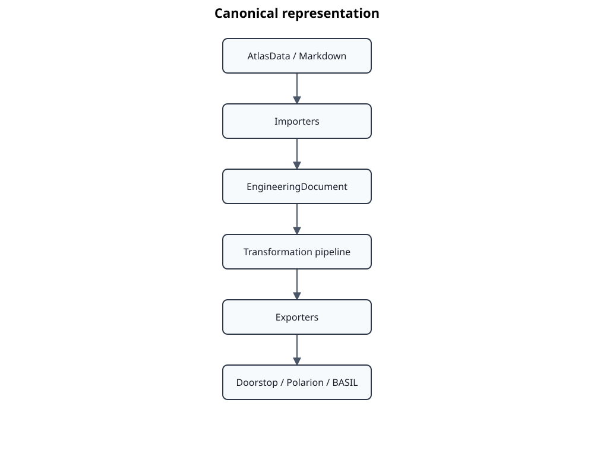

# ADR 0006 – EngineeringDocument as Canonical Intermediate Representation

- **Status:** Accepted
- **Date:** 2026-07-13

## Context

Standards Atlas integrates engineering knowledge originating from many
different engineering ecosystems.

Current and planned sources include:

- AtlasData
- Markdown
- Doorstop
- Polarion
- BASIL
- Travelogue
- future engineering repositories

Each ecosystem has its own representation of engineering documents,
metadata, traceability information and semantic structure.

A straightforward implementation would create dedicated transformations
between every pair of supported formats.



As the number of supported formats grows, this approach results in an
O(n²) integration problem and duplicates transformation logic across
multiple adapters.

Furthermore, semantic processing such as structure validation, heading
synchronization, annotation generation or AI-assisted analysis would
need to be implemented repeatedly for each representation.

## Decision

Standards Atlas defines **EngineeringDocument** as its single canonical
Intermediate Representation (IR).

Every external representation is imported into an EngineeringDocument.

Every export adapter consumes an EngineeringDocument.

Adapters never communicate directly with each other.


The EngineeringDocument becomes the only shared language inside the
application.

All semantic transformations operate exclusively on the canonical
representation.

## Repository

The canonical EngineeringDocument is also the persistent internal
representation.

Persisted documents are stored inside the local workspace.

```
.atlas/

    documents/
        EngineeringDocument

    transformations/

    warnings/

    doorstop/
```

This repository represents the current engineering state of the project
independent of any external engineering ecosystem.

## Consequences

### Advantages

Only one importer and one exporter are required for every supported
ecosystem.

The number of integrations grows linearly instead of quadratically.

Semantic transformations become completely reusable across all document
formats.

Application services remain independent of concrete adapters.

The repository stores the canonical engineering representation rather
than external file formats.

Future AI-assisted transformations operate on a single consistent data
model.

Testing becomes significantly simpler because every transformation can
be validated using EngineeringDocument objects without involving
external formats.

### Disadvantages

EngineeringDocument becomes a long-lived architectural contract.

Changes to the domain model require careful consideration because they
affect every adapter.

Some adapters require additional mapping logic to translate between
their native representation and the canonical model.

## Rationale

This architecture closely resembles modern compiler architectures.


Standards Atlas applies the same architectural principles to engineering
knowledge.


The EngineeringDocument therefore acts as the project's semantic
Intermediate Representation rather than merely a persistence model.

This architecture cleanly separates

- external engineering ecosystems,
- semantic processing,
- knowledge generation, and
- presentation.

## Relationship to previous ADRs

This decision builds upon previous architectural decisions.

- **ADR 0002** defines the canonical domain model.
- **ADR 0003** establishes the Hexagonal Architecture.
- **ADR 0004** introduces the Transformation Pipeline.
- **ADR 0005** separates public and local engineering knowledge.

This ADR defines the architectural role of the EngineeringDocument as
the canonical Intermediate Representation connecting all adapters,
repositories and transformations.
