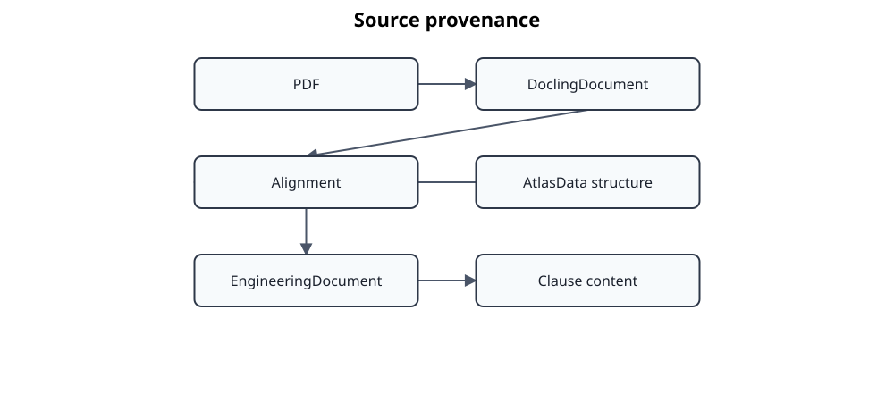

# ADR 0007 – Structured Clause Content and Private Source Provenance

## Status

Accepted with a superseded migration provision

## Date

2026-07-13

## Context

Standards Atlas currently imports the public structure of standards from
AtlasData into the canonical `EngineeringDocument` model. The actual normative
content is commonly available only as PDF. The planned IntelliDoc redesign will
use Docling to recover text, tables, pictures, formulas, lists and layout
information from these PDF files.

The previous `Clause` model contained only the optional fields `title` and
`text`. A single plain-text value cannot preserve the ordered and heterogeneous
content of a standard clause. It also discards source provenance such as page
numbers, bounding boxes and references to extracted PDF elements.

Markdown must not become the internal representation. It is a useful review and
export format, but conversion to Markdown before semantic alignment loses layout
and provenance information. Docling's native document model is richer, but it is
an adapter-specific extraction representation and must not become a dependency
of the Standards Atlas domain model.

The project also distinguishes public repository content from potentially
copyright-protected local content. Persisted canonical documents and future
Docling extraction artifacts are stored below `.atlas`, which is excluded from
Git commits.

## Decision

`EngineeringDocument` remains the canonical internal representation. AtlasData
continues to provide document identity, clause identifiers, references,
hierarchy and other public structural metadata.

`Clause` is extended with an ordered tuple of discriminated content blocks:

- `TextBlock`
- `ListBlock`
- `TableBlock`
- `PictureBlock`
- `FormulaBlock`
- `NoteBlock`

Each content block can carry one or more adapter-neutral `SourceEvidence`
objects. Source evidence may contain a source identifier, source type, locator,
page number, bounding box and extraction method. The domain model deliberately
does not import or expose Docling classes.



`Clause.content` is the canonical representation of protected clause content.
A stable `plain_text` projection is derived from the structured blocks for
adapters that currently require text, including Doorstop.

At the time of this decision, the legacy `Clause.text` constructor and persisted
field were retained as a temporary input migration path. That migration provision
has since been removed: `Clause.content` is now the only clause-content field and
old persisted artefacts or fixtures must be regenerated or migrated deliberately.
The structured-content and provenance decision itself remains valid.

Persisted engineering documents use a versioned JSON envelope:

```json
{
  "schema_version": 2,
  "document": {
    "key": {"value": "EN50716"},
    "document_type": "standard",
    "clauses": []
  }
}
```

The filesystem repository continues to load the previous unversioned format and
relies on the Clause migration logic to convert legacy text. Unknown schema
versions are rejected explicitly rather than interpreted silently.

Future raw Docling documents, alignment reports and derived private artifacts
will be serialized below `.atlas` as well. Raw extraction data must remain
separate from the enriched canonical document so that extraction and alignment
are reproducible and auditable.

## Consequences

### Advantages

The canonical model can preserve the order and semantics of heterogeneous PDF
content without using Markdown as an intermediate source of truth.

Docling remains replaceable because only its adapter maps native extraction
objects to domain content blocks and source evidence.

Tables, pictures, formulas, lists and notes can be populated directly during
PDF alignment instead of being flattened and reconstructed later.

Source provenance enables review, diagnostics and later visual navigation back
to the original PDF location.

The Doorstop exporter and future text-based consumers can use the derived
plain-text projection while richer adapters retain the full structure.

Versioned persistence establishes an explicit migration boundary for future
changes to the canonical model.

### Disadvantages

The domain model and its tests become more extensive.

Every importer and exporter must decide how much of the structured content it
can preserve.

The plain-text projection is necessarily lossy and cannot represent all table,
picture or formula semantics.

Persisted schema changes now require deliberate migration support and version
management.

## Implementation Notes

The first implementation introduces the structured content and provenance
models, migrates legacy text, versions filesystem persistence, and updates the
Doorstop mapping to use `Clause.plain_text`.

It does not yet introduce Docling as a dependency or implement PDF conversion
and alignment. Those capabilities will be added through dedicated adapters and
application services in later work units.

## Relationship to Previous ADRs

- **ADR 0003** establishes the Hexagonal Architecture and adapter boundaries.
- **ADR 0004** establishes the transformation pipeline.
- **ADR 0005** separates public repository data from private local content.
- **ADR 0006** establishes `EngineeringDocument` as the canonical intermediate
  representation.

This ADR refines ADR 0006 by defining how heterogeneous, protected document
content and its provenance are represented inside the canonical model.

## Amendment

The temporary `Clause.text` compatibility path described by the original decision is no
longer part of the implemented architecture. This amendment records the current state
without rewriting the historical context that motivated structured clause content.
