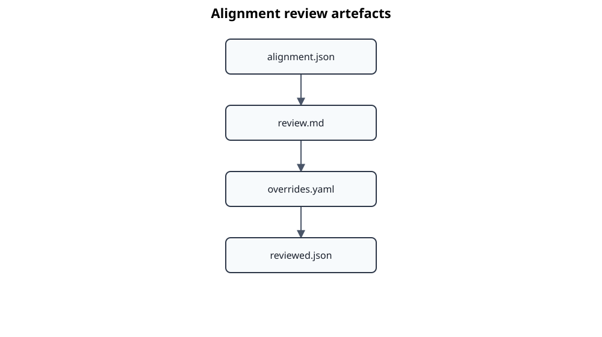

# ADR 0014: Introduce alignment review and manual overrides

## Status

Accepted

## Context

The automatic alignment pipeline produces deterministic and reproducible
results, but real standards contain layouts that cannot always be resolved
reliably by generic heuristics. Missing, inferred, ambiguous, conflicting and
unexpected alignments must therefore be reviewed before extracted content is
written into the canonical `EngineeringDocument`.

Editing the generated alignment result directly would mix automatic and manual
decisions and would be overwritten by later runs. Parsing decisions from an
edited Markdown file would also be fragile.

## Decision

Standards Atlas introduces a separate review layer with three private artefacts:

`alignment.json` remains the immutable automatic result. `review.md` is a
human-readable view containing problematic clauses, candidate alternatives and
normalized source context. `overrides.yaml` contains the authoritative manual
decisions. `reviewed.json` is produced by validating and applying those
decisions.

Supported override actions are:

- assign a candidate to a clause;
- ignore a false-positive candidate;
- explicitly confirm a clause without an anchor;
- define a manual clause range;
- correct the interpretation of an inline remainder;
- select a following term or heading item.

Manual assignments receive `AlignmentStatus.MANUAL`. Overrides reference stable
clause and item identifiers. The override document stores a hash of the
automatic alignment so that stale decisions are rejected when the source
alignment changes.

Markdown is used only as a review representation. It is not parsed as the
source of manual decisions.

## Consequences

- Automatic and reviewed alignments remain clearly distinguishable.
- Manual decisions survive repeated automatic alignment runs when their source
  alignment is unchanged.
- Invalid, duplicated, reversed or orphaned override references are detected
  before application.
- Review can proceed iteratively until no unresolved missing, ambiguous or
  conflicting alignments remain.
- Only `reviewed.json` is eligible as input for future content-block mapping.
- All potentially protected review context remains below `.atlas`.
