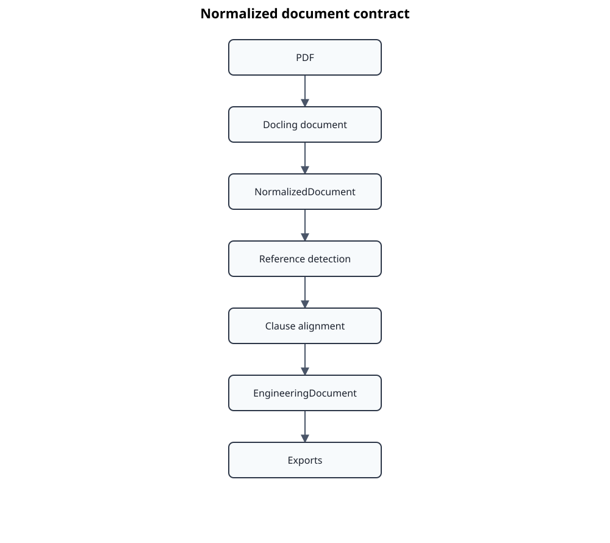

# ADR-0026: NormalizedDocument Contract

## Status

Accepted

## Date

2026-07-21

## Context

The IntelliDoc processing pipeline transforms engineering standards through a
series of increasingly structured representations.



The previous normalization implementation was primarily an implementation
detail of the reference detection stage.

As the project evolved, several requirements emerged:

* normalization must be deterministic;
* no source information may disappear without explanation;
* alignment decisions must be reproducible;
* every normalized item must be traceable back to its origin;
* diagnostics must explain how a clause was produced.

These requirements cannot be satisfied by treating normalization as a simple
text transformation.

A dedicated domain model is therefore required.

## Decision

A new canonical intermediate representation named **NormalizedDocument** is
introduced.

Normalization is promoted from an implementation detail to an explicit
processing stage with its own persistence format, domain model and invariants.

Reference detection and alignment operate exclusively on
NormalizedDocument.

Neither stage accesses Docling documents directly.

---

## Responsibilities

### Docling

Docling is responsible for extracting the physical document.

It represents what was observed.

Docling does **not** decide

* document semantics,
* clause hierarchy,
* engineering structure,
* reference interpretation.

---

### NormalizedDocument

NormalizedDocument represents a deterministic engineering-oriented view of the
physical document.

Its responsibilities are

* remove purely presentational differences,
* merge document fragments belonging to the same logical item,
* classify document elements,
* preserve complete provenance,
* preserve stable ordering.

Normalization does **not**

* identify engineering clauses,
* perform alignment,
* infer missing references.

---

### Reference Detection

Reference detection analyses NormalizedDocument.

It discovers candidate clause references but does not decide which candidate is
correct.

Multiple candidates may coexist.

---

### Alignment

Alignment selects the most plausible mapping between engineering clauses and
reference candidates.

Alignment never modifies NormalizedDocument.

---

## Domain Model

A NormalizedDocument contains an ordered sequence of NormalizedItems.

Each item has

* a stable identifier;
* a stable document order;
* one or more originating Docling items;
* optional page information;
* original text;
* normalized text;
* structural classification.

The identifier of a NormalizedItem remains stable as long as the logical
content of the document remains unchanged.

---

## Provenance

Every NormalizedItem shall reference all originating Docling items.

Example

```
Docling
--------
81  "7.4.3"
82  "Software architecture"

↓

Normalized
----------
57  "7.4.3 Software architecture"

source_item_ids = (81, 82)
```

No provenance information is discarded.

---

## Accounting Invariant

Every Docling text item must be accounted for.

Each source item shall belong to exactly one of the following categories:

* represented by a NormalizedItem;
* classified as page header;
* classified as page footer;
* classified as page number;
* classified as illustration;
* classified as table;
* classified as code;
* explicitly ignored.

The number of unaccounted items shall therefore always be zero.

```
Source items          2521
Normalized items      2468
Headers                 21
Footers                 20
Tables                  11
Ignored                  1
----------------------------
Unaccounted              0
```

This invariant is considered part of the public contract of the
normalization stage.

---

## Ordering Invariant

NormalizedItems preserve document order.

Normalization may merge adjacent source items.

Normalization shall never reorder logical content.

Repeated normalization of the same input shall produce byte-identical output.

---

## Lossless Transformation

Normalization is considered lossless with respect to engineering information.

The process may

* merge items;
* normalize whitespace;
* normalize numbering;
* classify items.

The process shall not silently remove textual content.

Discarded information must always be represented by an explicit
classification.

---

## Persistence

NormalizedDocument is persisted in the project workspace.

Persistence serves three purposes:

* reproducible processing;
* diagnostics;
* stable review workflows.

Subsequent pipeline stages consume the persisted representation rather than
recomputing normalization.

---

## Diagnostics

Normalization provides explicit diagnostics.

Typical metrics include

* source items;
* normalized items;
* merged groups;
* classified headers;
* classified footers;
* classified page numbers;
* ignored items;
* unaccounted items.

The diagnostics are intended to detect regressions before reference detection
or alignment are executed.

---

## Consequences

### Advantages

* Deterministic processing.
* Complete provenance.
* Lossless normalization.
* Reproducible alignment.
* Stable review workflows.
* Better diagnostics.
* Clear separation of responsibilities.

### Disadvantages

* Additional persisted representation.
* Additional domain model.
* Slightly increased implementation complexity.

## Alternatives Considered

### Reference Detection directly on Docling

Rejected.

Reference detection would become responsible for normalization, making
diagnostics difficult and introducing duplicated heuristics.

---

### Recompute normalization for every processing stage

Rejected.

Different stages could produce different normalized views, reducing
reproducibility and making review workflows unstable.

Persisting the normalized representation establishes a single source of truth.

---

### Normalize directly into EngineeringDocument

Rejected.

EngineeringDocument represents engineering semantics.

Normalization represents document structure.

Keeping both representations separate preserves the distinction between
observed document content and interpreted engineering information.

## References

* ADR-0003 – Hexagonal Architecture
* ADR-0004 – Transformation Pipeline
* ADR-0025 – AtlasData Compatibility and Composed Multi-Part Exports

## Deterministic Identity

Normalized item identifiers are derived from the source document identity, the
normalized item type and the ordered set of source item identifiers. They do not
depend on processing time, sequence-number repair or temporary identifiers
created by transformation steps.

The identifier therefore remains stable when an unchanged logical source item is
processed again, while different source lineages cannot silently share an
identifier merely because their visible text is identical.

## Deterministic Persistence

The persisted `document.json` is the deterministic artifact payload. It uses a
canonical UTF-8 JSON representation with sorted object keys, stable indentation
and a final newline. Runtime timestamps are not part of this payload.

Non-deterministic audit information is stored separately in `run.json`. The run
metadata records the creation time and the SHA-256 hash of the canonical
`document.json` payload. Consumers may therefore distinguish artifact identity
from the execution that materialized it.

A normalized artifact is incomplete when either file is missing, cannot be
validated, or the hash recorded in `run.json` does not match `document.json`.

## Schema Evolution

Schema version 3 removes `created_at` from `NormalizationMetadata`. Readers may
accept older payloads for migration, but newly written artifacts always follow
the deterministic split between `document.json` and `run.json`.
