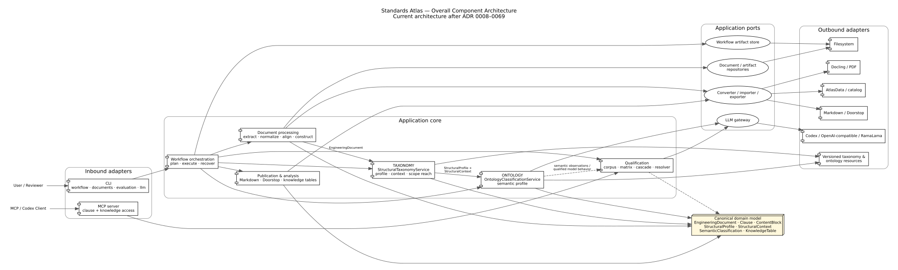

# Component model

The UML component view is the primary map of the current implementation. It groups the major composition roots, application capabilities, domain core, ports, adapters, and external systems. It intentionally groups families of services and repositories instead of listing every concrete class, command module, artifact type, and compatibility facade described in this document.

A smaller thematic overview remains available in the [diagram catalog](diagrams/README.md) as `component-model.svg`.

The component model separates stable knowledge structures from orchestration and technology integrations.

## Inbound adapters

The command-line interface is the main composition root and exposes document, workflow, evaluation, qualification, LLM, and MCP commands. The MCP adapter exposes a deliberately restricted read-only clause service. Future HTTP or desktop interfaces should call the same application use cases rather than reaching into repositories directly.

## Application components

| Component | Responsibility |
|---|---|
| Catalog | Resolve standards, parts, families, source locations, and workflow intent. |
| Workflow | Plan side-effect-free execution, execute stages, recover incomplete runs, and report derivations. |
| Extraction and normalization | Convert source publications, normalize structural evidence, and persist deterministic transformations. |
| Alignment and construction | Align extracted ranges with reference structures and construct canonical engineering documents. |
| Structural taxonomy | Deterministically materialize structural profiles, hierarchy context, sibling sequences, contextual node content, and structural reference edges. |
| Semantic ontology | Apply the qualified production classifier to content plus structural context and persist modular ontology dimensions. |
| Publication | Project engineering documents into Markdown and Doorstop without changing the canonical aggregate. |
| Generic evaluation | Run versioned datasets, prompts, models, metrics, regression checks, and reports. |
| Semantic qualification | Build eligible clause corpora, generate proposals, review annotations, resolve references, and qualify model/prompt candidates. |
| Prompt workbench | Compile and execute reproducible single-clause prompt experiments with explicit context and model selection. |
| Pipeline qualification | Verify extraction and normalization against checked-in golden corpora and persist auditable qualification evidence. |
| Table knowledge projection | Project structured tables into addressable records, classify supported matrix schemas, and derive evidence-backed concepts and relations. |
| Analysis | Extract methods, techniques, references, and future cross-standard relations. |

## Domain components

The domain layer contains immutable value objects and aggregates for standards, engineering documents, clauses, structured content, source evidence, structural profiles, semantic classifications, knowledge tables and records, annotations, relations, and artifact lineage. It has no runtime, filesystem, protocol, or model-provider responsibilities.

## Outbound adapters

- **Docling** converts selected PDF pages into extracted-document contracts.
- **Filesystem** persists stage artifacts, engineering documents, reviews, corpora, reports, and runtime state.
- **AtlasData** imports and round-trips structural baselines.
- **Markdown** creates readable document and review projections, including resolved internal links.
- **Doorstop** creates requirement-document hierarchies and installs publication templates.
- **LLM** provides Codex CLI and OpenAI-compatible gateways plus managed RamaLama runtime control.
- **MCP transport** hosts the read-only clause and knowledge-table service over STDIO or Streamable HTTP.

## Cross-cutting component relationships

The application layer is not a single monolith. Workflow orchestration coordinates extraction, normalization, alignment, construction, structural taxonomy, semantic ontology, and publication through focused services and ports. Generic evaluation is provider-neutral; semantic qualification depends on it and adds clause access, standards-specific corpora, review, consensus, and qualification workflows. Runtime management for RamaLama and MCP belongs to the executable and adapter boundaries, not to the domain model.

The diagram does not enumerate every specialized service, such as AtlasData lifecycle operations, extraction inspection, document selection, reference resolution, methods-and-techniques extraction, or individual review renderers. These are represented by their owning application capability and documented in the corresponding topic pages.

## Composition

Concrete adapters are selected at the executable boundary. Application services should be constructible in tests with in-memory or temporary-filesystem implementations. The application boundary deliberately separates structural taxonomy (`application.structure` plus `StructuralTaxonomyService`) from semantic ontology (`application.semantic_ontology` plus semantic classification services). No application service may own both classification responsibilities.
