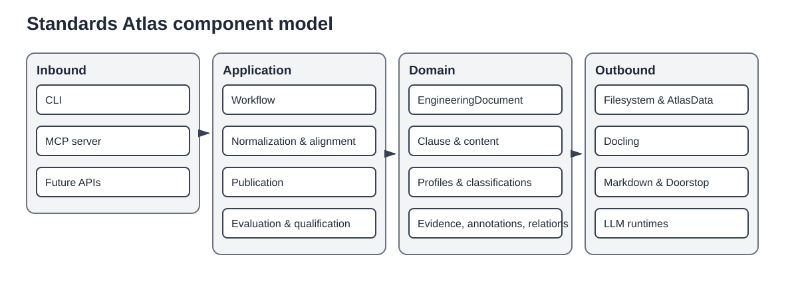

# Component model

The component model separates stable knowledge structures from orchestration and technology integrations.

## Inbound adapters

The command-line interface is the main composition root and exposes document, workflow, evaluation, qualification, LLM, and MCP commands. The MCP adapter exposes a deliberately restricted read-only clause service. Future HTTP or desktop interfaces should call the same application use cases rather than reaching into repositories directly.

## Application components

| Component | Responsibility |
|---|---|
| Catalog | Resolve standards, parts, families, source locations, and workflow intent. |
| Workflow | Plan side-effect-free execution, execute stages, recover incomplete runs, and report derivations. |
| Extraction and normalization | Convert source publications, normalize structural evidence, and persist deterministic transformations. |
| Alignment and construction | Align extracted ranges with reference structures and construct canonical engineering documents. |
| Publication | Project engineering documents into Markdown and Doorstop without changing the canonical aggregate. |
| Generic evaluation | Run versioned datasets, prompts, models, metrics, regression checks, and reports. |
| Semantic qualification | Build clause corpora, generate proposals, review annotations, resolve references, and qualify model/prompt candidates. |
| Analysis | Extract methods, techniques, references, and future cross-standard relations. |

## Domain components

The domain layer contains immutable value objects and aggregates for standards, engineering documents, clauses, structured content, source evidence, structural profiles, semantic classifications, annotations, relations, and artifact lineage. It has no runtime, filesystem, protocol, or model-provider responsibilities.

## Outbound adapters

- **Docling** converts selected PDF pages into extracted-document contracts.
- **Filesystem** persists stage artifacts, engineering documents, reviews, corpora, reports, and runtime state.
- **AtlasData** imports and round-trips structural baselines.
- **Markdown** creates readable document and review projections, including resolved internal links.
- **Doorstop** creates requirement-document hierarchies and installs publication templates.
- **LLM** provides Codex CLI and OpenAI-compatible gateways plus managed RamaLama runtime control.
- **MCP transport** hosts the clause service over STDIO or Streamable HTTP.

## Composition

Concrete adapters are selected at the executable boundary. Application services should be constructible in tests with in-memory or temporary-filesystem implementations. Older facades below `application/services/` may re-export canonical implementations during migration, but they are not architectural ownership boundaries.
