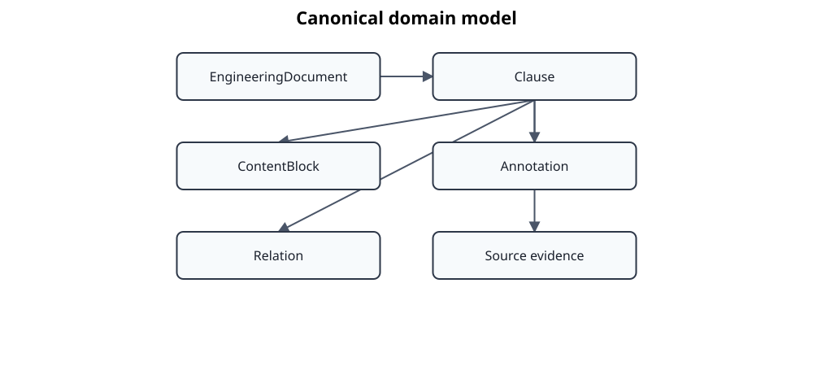

# Domain model

`EngineeringDocument` is the canonical aggregate. It is identified by a
`DocumentKey` and contains ordered `Clause` objects together with document
metadata, annotations, and artifact lineage. The model is intentionally broader
than a standard and can also represent specifications, reports, safety-case
artifacts, and other structured engineering documents.

## Clauses and structured content

A `Clause` carries a stable identifier, standard reference, clause type, title,
ordered structured content, hierarchy information, adapter-neutral export
attributes, semantic classification, and an optional multidimensional
`StructuralProfile`. Content blocks distinguish paragraphs,
lists, tables, figures, formulas, and other material rather than flattening the
protected source into Markdown.

The `plain_text` property is a deterministic projection of the structured
content. It is used for search and evaluation, but it is not a second canonical
content representation.

## SemanticClassification

Every clause contains a `SemanticClassification`. It replaces the former flat
`semantic_roles` vocabulary with independent dimensions:

- `statement_functions` for requirement, recommendation, permission,
  prohibition, definition, description, rationale, example, note, and related
  statement functions;
- process-model functions such as objectives, prerequisites, decisions, and outputs;
- `applicability_functions` for scope, conditions, inclusions, exclusions, and
  exceptions;
- `responsibility_functions` for assignments, exclusions, and role conditions;
- `document_structure`, qualified by a document-family taxonomy;
- `normative_status`;
- versioned `domain_functions` owned by a `KnowledgeDomain` taxonomy;
- resolved internal and external semantic relations.

The dimensions are intentionally orthogonal. A clause can, for example, be a
normative requirement, allocate responsibility, belong to a document-family
section, and participate in external relations at the same time. Taxonomy-owned
strings remain namespaced and versioned so new domains do not require expansion
of a central enum.

## StructuralProfile

`StructuralProfile` is a separate domain contract for multidimensional
structural classification. It contains:

- a broad `canonical_section` shared across document families;
- open, namespaced `document_categories` for family-specific structure;
- open, namespaced `domain_categories` for KnowledgeDomain structure;
- explicit normative, informative, or unspecified `annex_status`.

A deterministic `StructuralProfileClassifier` derives profiles from references
and headings. `Clause.structural_profile` stores the result as optional canonical
clause metadata. AtlasData import creates the initial profile, content enrichment
updates it after final titles are available, and filesystem persistence preserves
it without invalidating legacy documents that do not contain the field. Doorstop
exports and evaluation clause descriptors expose the available dimensions.

`SemanticClassification.document_structure` and `StructuralProfile` currently
overlap in purpose. `SemanticClassification` carries the semantic-evaluation
dimension, while `StructuralProfile` is the extensible document-family and
KnowledgeDomain taxonomy model introduced by ADR 0050. Their eventual
consolidation remains a separate architecture decision.

## Annotations, relations, and lineage

Annotations remain separate from source clauses. Their visibility controls
whether they may be exported publicly. Semantic relations are stored within
`SemanticClassification`, while annotation records retain reviewer and
qualification information without mutating protected source content.

Artifact lineage records how the aggregate was derived. `NormalizedDocument`,
reference candidates, alignments, transformation ledgers, and similar objects
are pipeline contracts and evidence; they are not substitutes for the canonical
`EngineeringDocument` aggregate.

Structural scope and semantic applicability are intentionally separate. The structural
profile records that a clause belongs to a Scope section. Semantic classification records
only explicit inclusion, exclusion, exception, or conditional applicability expressed by
the clause text.
