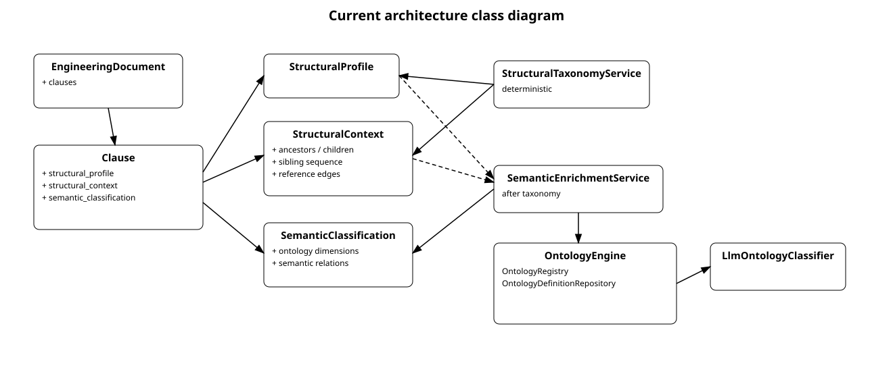

# Domain model

The multi-view UML diagram contains the canonical domain model and a second view of principal application services, ports, and infrastructure adapters. The first view is the detailed companion to this document. It deliberately focuses on stable architectural types and representative relationships; helper models, all enum values, serialization schemas, validation internals, and every specialized application artifact are documented in code and in the topic-specific documents rather than duplicated in the class diagram.

A simplified domain-only orientation diagram remains available as `domain-model.svg` in the [diagram catalog](diagrams/README.md).

## Canonical aggregate

`EngineeringDocument` is the canonical representation of one normalized standard, standard part, regulatory publication, or engineering document. It identifies the source document and owns an ordered clause hierarchy. Multi-part outputs are composed explicitly rather than by treating an export format as the aggregate.

A `Clause` contains:

- a stable `ClauseId` and human-readable reference;
- structured `ContentBlock` values instead of a single text field;
- parent/child structure and clause type;
- source evidence such as page anchors and bounding boxes;
- a multi-dimensional `StructuralProfile`;
- optional `SemanticClassification` results;
- annotations and relations;
- optional Doorstop projection attributes.

Plain text is derived from structured content through `render_content_as_plain_text`; it is not a second authoritative representation.

## Structured content

Content is represented by immutable blocks such as text, lists, tables, notes, pictures, formulas, and code. This preserves information needed for lossless normalization, readable exports, and later semantic analysis. Nested lists and table cells remain structured rather than being flattened prematurely.

## Structural profile

`StructuralProfile` describes independently determined structural dimensions, including canonical document section, domain category, annex status, and taxonomy provenance. It replaced the former one-dimensional `Clause.semantic_roles` model. A clause can therefore be, for example, part of a normative annex, a verification-oriented domain category, and a canonical requirements section without forcing those meanings into one enum.

## Semantic classification

`SemanticClassification` models statement-level interpretation separately from document structure. Its dimensions include normative status, statement function, applicability, responsibility, process function, and semantic relations. Structural evidence and semantic interpretation are related but not interchangeable.

## Evidence and provenance

`SourceEvidence` links knowledge back to physical source material through page and geometric anchors. `ArtifactLineage` records how persisted artifacts derive from prior artifacts and deterministic transformations. Evidence belongs in the domain contract; adapter-specific parser objects do not.

## Knowledge extension points

`ClauseAnnotation` adds reviewed or generated explanatory knowledge with explicit visibility. `Relation` and semantic relation objects connect clauses and documents. These types are the basis for the planned cross-standard relationship graph. Model-generated proposals remain external evaluation artifacts until accepted and published into canonical data.

## Relationship to application architecture

The second page of the UML class diagram shows representative application services consuming ports implemented by infrastructure adapters. It is included to make the boundary around the canonical model explicit. It is not a complete service inventory: evaluation, semantic qualification, MCP transport, LLM runtime management, AtlasData lifecycle services, and several specialized workflow helpers are covered by their own architecture documents and diagrams.

## Model rules

- Identifiers are explicit value objects.
- Domain models are immutable Pydantic models where practical.
- Export-specific metadata is isolated and optional.
- Internal references resolve against known clauses before Markdown publication.
- Normative status and structural dimensions may inherit from document structure only through explicit normalization rules.
- No domain model depends on storage paths or external SDK types.

## Engineering knowledge ontology

`SemanticClassification.knowledge_kinds` identifies what engineering knowledge a clause
represents independently from how the statement is phrased. The central vocabulary is
`technique`, `measure`, `method`, `process`, `artifact`, `role`, `evidence`, and `concept`.
For example, a clause can simultaneously be an informative `description` and a
`technique`. Domain-specific refinements remain in versioned `domain_functions`.
