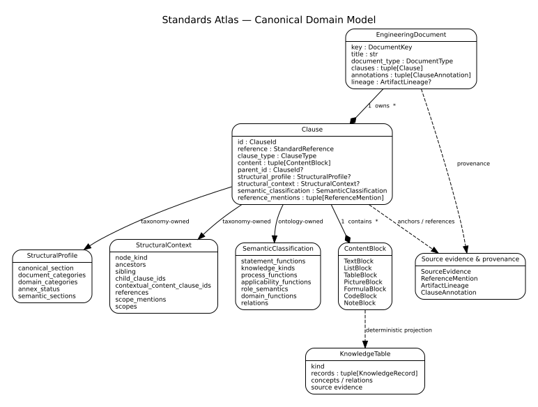
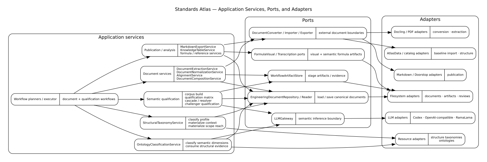
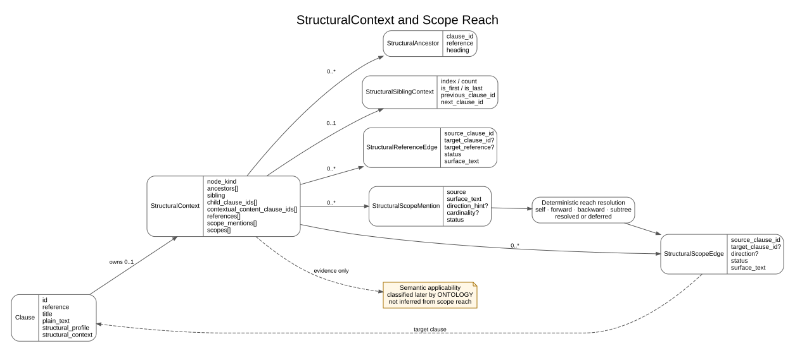

# Domain model

## Canonical domain model

This UML class diagram is the detailed companion to the domain model described on this page. It focuses on stable architectural types and representative ownership relationships. Helper models, complete enum vocabularies, serialization schemas, validation internals, and specialized evaluation artifacts remain authoritative in code and in the topic-specific documents rather than being duplicated here.

A simplified domain-only orientation diagram remains available as `domain-model.svg` in the [diagram catalog](diagrams/README.md).

## Application boundary around the domain

The application architecture is intentionally shown in a separate UML diagram. It identifies the principal application services, their outbound ports, and representative infrastructure adapters without mixing those dependencies into the canonical domain model. This separation mirrors the hexagonal architecture: domain types remain independent from storage, external SDKs, model providers, and runtime protocols.

## Canonical aggregate

`EngineeringDocument` is the canonical representation of one normalized standard, standard part, regulatory publication, or engineering document. It identifies the source document and owns an ordered clause hierarchy. Multi-part outputs are composed explicitly rather than by treating an export format as the aggregate.

A `Clause` contains:

- a stable `ClauseId` and human-readable reference;
- structured `ContentBlock` values instead of a single text field;
- parent/child structure and clause type;
- source evidence such as page anchors and bounding boxes;
- a multi-dimensional `StructuralProfile` and materialized `StructuralContext`;
- ontology-owned `SemanticClassification` results and semantic relations;
- annotations and relations;
- optional Doorstop projection attributes.

Plain text is derived from structured content through `render_content_as_plain_text`; it is not a second authoritative representation.

## Structured content

Content is represented by immutable blocks such as text, lists, tables, notes, pictures, formulas, and code. This preserves information needed for lossless normalization, readable exports, and later semantic analysis. Nested lists and table cells remain structured rather than being flattened prematurely. A `FormulaBlock` remains a formula even when semantic transcription is unavailable; in that state it may carry a PNG visual asset rendered from its source bounding box instead of being demoted to a generic `PictureBlock`.

Tables can additionally be projected into addressable `KnowledgeTable` and
`KnowledgeRecord` artefacts. These projections are deterministic views of the canonical
`TableBlock`; they are not a second persisted source of truth. A record preserves its
original cells and source evidence and may carry a conservative semantic interpretation.

## Structural profile and context

`StructuralProfile` describes independently determined structural dimensions, including canonical document section, domain category, annex status, and taxonomy provenance. `StructuralContext` materializes the surrounding graph evidence required by later processing: node/leaf role, ancestors, children, sibling position, predecessor/successor links, contextual ancestor content, structural reference edges, and structural scope mentions/edges that capture the reach of scope statements without interpreting their applicability semantics. Both are owned by the deterministic `TAXONOMY` stage.

A clause can therefore be located in a verification-oriented branch, inherit lifecycle context from headings, and occupy the last position of a sibling sequence without interpreting its statement-level meaning.

### StructuralContext and scope reach

`StructuralContext` is a materialized, structure-only graph view around one clause. Ancestors,
sibling position, child ids, contextual ancestor content, references, scope mentions, and
scope edges are all derived deterministically. `StructuralScopeMention` preserves the surface
signal and optional direction/cardinality hints; `StructuralScopeEdge` records the resolved or
deferred structural reach to target clauses.

Scope reach must not be confused with semantic applicability. A structural edge can tell the
ontology classifier that a statement structurally reaches the next sibling, a subtree, or the
current clause, but whether that statement expresses an applicability condition remains an
ontology decision.

## Semantic classification

`SemanticClassification` stores ontology results and semantic relations separately from document structure. Automatic assignment of statement functions, knowledge kinds, process functions, applicability functions, and role-relation types is owned exclusively by the `ONTOLOGY` stage. Structural evidence is supplied through `StructuralProfile` and `StructuralContext`; it is evidence for ontology classification, not semantic truth. Some legacy structural compatibility fields remain in the persisted model until a later schema migration, but no active classifier derives ontology values outside `ONTOLOGY`.

## Evidence and provenance

`SourceEvidence` links knowledge back to physical source material through page and geometric anchors. Formula visual preservation consumes those anchors without changing their meaning. `ArtifactLineage` records how persisted artifacts derive from prior artifacts and deterministic transformations. Evidence belongs in the domain contract; adapter-specific parser objects do not.

## Table-derived knowledge

`KnowledgeTable` identifies one structured table within a clause and owns ordered
`KnowledgeRecord` rows. Stable IDs are derived from the document, clause, table position,
and row position. The table projection preserves captions, header cells, row and column
spans, source evidence, and a deterministic plain-text representation for later retrieval.

Known table kinds currently include generic tables, IEC 61508 technique-recommendation
matrices, and portable work-product, responsibility, verification-criteria, traceability,
and applicability matrices. Portable interpretations use `KnowledgeConcept` and
`KnowledgeRelation` values with exact source-column provenance. IEC 61508 interpretations
add SIL-qualified recommendation levels and resolved clause references. Unrecognized or
ambiguous tables remain generic rather than receiving guessed semantics.

See [Table semantics](table-semantics.md) for the projection and evaluation boundaries.

## Knowledge extension points

`ClauseAnnotation` adds reviewed or generated explanatory knowledge with explicit visibility. `Relation` and semantic relation objects connect clauses and documents. These types are the basis for the planned cross-standard relationship graph. Model-generated proposals remain external evaluation artifacts until accepted and published into canonical data.

## Relationship to application architecture

The separate application-architecture class diagram shows representative application services consuming ports implemented by infrastructure adapters. It makes the boundary around the canonical model explicit without coupling the domain view to infrastructure details. It is not a complete service inventory: evaluation, semantic qualification, MCP transport, LLM runtime management, AtlasData lifecycle services, and specialized workflow helpers are covered by their own architecture documents and diagrams.

## Model rules

- Identifiers are explicit value objects.
- Domain models are immutable Pydantic models where practical.
- Export-specific metadata is isolated and optional.
- Internal references resolve against known clauses before Markdown publication.
- Structural dimensions and inherited context are materialized only by the deterministic taxonomy stage.
- Automatic ontology dimensions are assigned only by the ontology stage or imported as explicit reviewed/public annotations.
- No domain model depends on storage paths or external SDK types.

## Formal semantic and context projection

`EngineeringDocument` remains canonical. Formal semantics are represented as a rebuildable `FormalSemanticProjection` containing provider-neutral TBox, RBox, ABox, and CBox assertions. The CBox carries semantic, structural, and epistemic context sourced from Knowledge Domains, taxonomies, structural context, and lineage rather than folding those concerns into the formal ontology itself.

The stable Standards Atlas namespace is `http://lunetix.org/standards-atlas#` with prefix `stat`. No RDF framework, graph database, or GraphRAG implementation is part of the domain model. See [Formal Semantic & Context Model](formal-semantic-context-model.md).

## Engineering knowledge ontology

`SemanticClassification.knowledge_kinds` identifies what engineering knowledge a clause
represents independently from how the statement is phrased. The central vocabulary is
`technique`, `measure`, `method`, `process`, `artifact`, `role`, `evidence`, and `concept`.
For example, a clause can simultaneously be an informative `description` and a
`technique`. Domain-specific refinements remain in versioned `domain_functions`.
