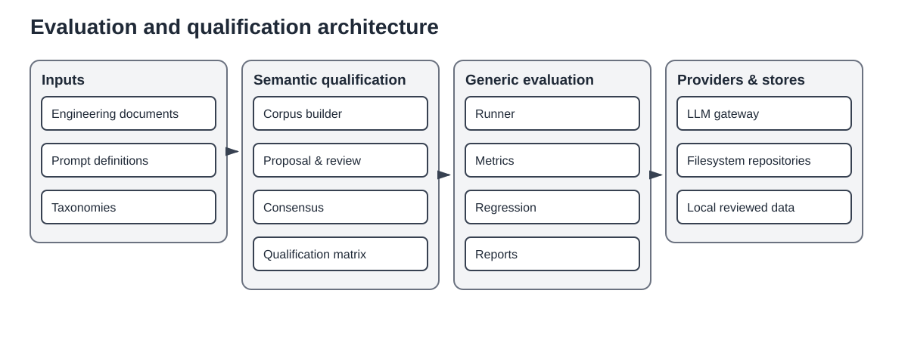

# Evaluation architecture

Standards Atlas separates provider-neutral evaluation infrastructure from standards-specific semantic qualification.

## Generic evaluation

`application.evaluation` owns versioned prompts, schemas, datasets, runners, per-case observations, aggregate metrics, regression comparison, and reports. It depends on the `LlmGateway` port but has no knowledge of clauses, structural taxonomies, standards publication policy, or HITL annotation precedence.

## Semantic qualification

`application.semantic_qualification` adds:

- transport-neutral clause discovery through `ClauseProvider`;
- representative stratified corpus construction;
- structural-profile and semantic-classification tasks;
- reference extraction and resolution;
- baseline and model proposal runs;
- local Markdown review and reviewed-data publication;
- qualification matrices and repeated observations;
- model consensus and golden-corpus proposals;
- adaptive interview planning for difficult review cases.

It may depend on generic evaluation; the reverse dependency is forbidden.

## Artifact separation

Corpora, proposal runs, reviewed annotations, consensus reports, and qualification reports are separate artifacts. Published reviewed data has higher authority than local review files; local review has higher authority than generated proposals only where the repository policy explicitly states this.

## Matrix execution

A matrix candidate is a reproducible combination of model, prompt, context mode, reasoning configuration, repetition, and runtime settings. Execution persists observations incrementally so `--resume` can continue incomplete work. `--overwrite` replaces selected outputs; `--recompute` intentionally reruns completed observations. Metrics distinguish availability, parse success, prediction success, agreement, calibration, and task quality.

## Compatibility

Older imports below `application.services.evaluation` may re-export canonical types temporarily. New code must use `application.evaluation` or `application.semantic_qualification` directly.
