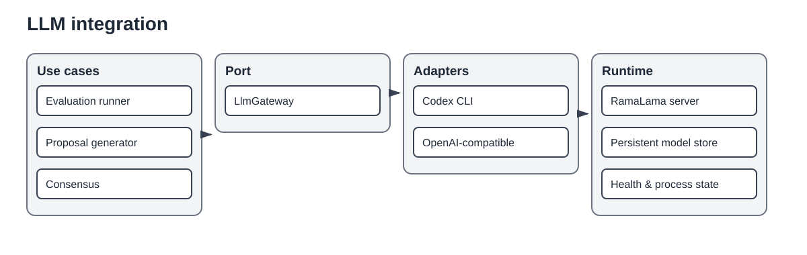

# LLM integration

LLMs are optional outbound capabilities used by evaluation and knowledge-enrichment workflows. They are not part of deterministic document extraction or normalization.

## Application port

`LlmGateway` is the provider-neutral application port. Evaluation runners submit versioned prompts and schemas through this port and receive validated responses or explicit gateway errors. Application code must not depend on OpenAI-compatible payloads, Codex process details, or RamaLama container commands.

## Adapters

- `CodexCliLlmGateway` invokes a restricted Codex CLI profile, optionally with MCP clause access.
- The OpenAI-compatible adapter communicates with local or remote compatible endpoints.
- `RamaLamaServer` manages local model server lifecycle, health, persistent model storage, logs, and stop semantics.

## Lifecycle

CLI commands expose start, status, preload, and stop operations. Workflows that temporarily acquire a managed runtime must release it in success and failure paths. Status is based on verified process and health state rather than stale PID metadata alone. Model files should live on a persistent volume rather than inside disposable containers.

## Qualification boundary

A model name does not establish fitness. Qualification matrices combine model, prompt, structural context, reasoning mode, repetition, and runtime configuration. Runs are resumable and persist individual observations. Reliability metrics use rates in the range 0..1 and distinguish prediction success from semantic quality.

## Safety and privacy

Protected clause text may be sent only to explicitly approved local or remote gateways. MCP exposure and LLM access are separate policy decisions. Audit and run artifacts must avoid credentials and unnecessary source paths.
