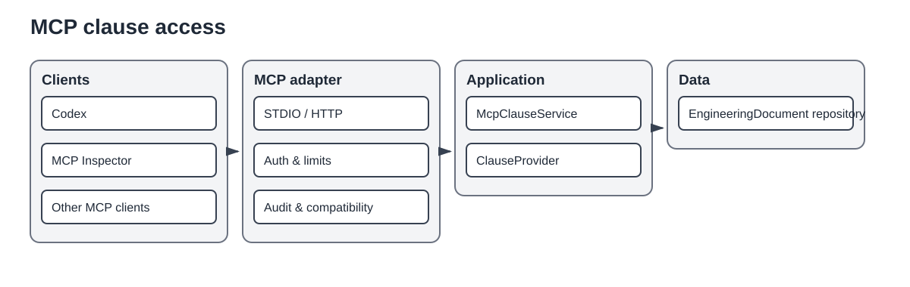

# MCP clause server



The diagram is a protocol and trust-boundary view. It does not enumerate every MCP tool/resource, configuration field, compatibility-probe step, audit event, or process-management class described below.

The MCP server is a read-only inbound adapter around the transport-neutral clause-access application boundary.

## Dependency direction

```text
MCP client
    -> protocol and security adapter
    -> McpClauseService / ClauseProvider
    -> EngineeringDocumentClauseProvider
    -> persisted EngineeringDocument aggregates
```

The adapter does not parse arbitrary files, perform document normalization, or call an LLM. Codex may use MCP and an LLM in the same workflow, but those are independently configured boundaries.

## Capabilities

Read-only tools expose document discovery, clause reads, filtered lists, search, and reproducible sampling. Resources expose document and clause representations for direct contextual reads. Limits and text exposure are controlled by configuration.

## Managed operation

```bash
uv sync --extra mcp
uv run standards-atlas mcp start --config cfg/mcp.yaml
uv run standards-atlas mcp status --config cfg/mcp.yaml
uv run standards-atlas mcp stop --config cfg/mcp.yaml
```

Foreground serving remains available for diagnostics. Managed operation stores process state and logs below `.atlas/runtime/mcp`.

## Streamable HTTP security

Remote operation validates host and origin headers, optionally enforces bearer authentication, limits request bodies, and writes privacy-conscious JSON-lines audit records. TLS termination is external. A production multi-user deployment should integrate an OAuth 2.1 authorization server and SDK token verification instead of treating the built-in token mode as enterprise identity management.

## Compatibility probe

An independent JSON-RPC probe verifies initialization, protocol negotiation, required tool discovery, execution of `list_standards`, and discovery of the documents resource. It tests the external contract rather than FastMCP internals.

## Formula transcription enrichment

Visual-only formulas preserved by the normalization pipeline are available through `list_untranscribed_formulas` and `get_formula`. The latter returns the formula image, source evidence, and adjacent text context for multimodal transcription. `submit_formula_transcription` persists a provenance-bearing LaTeX enrichment artifact before deterministically applying it to the canonical `FormulaBlock`. Mutating formula transcription is opt-in through `mcp.capabilities.formula_transcription`; document allowlists remain enforced.
