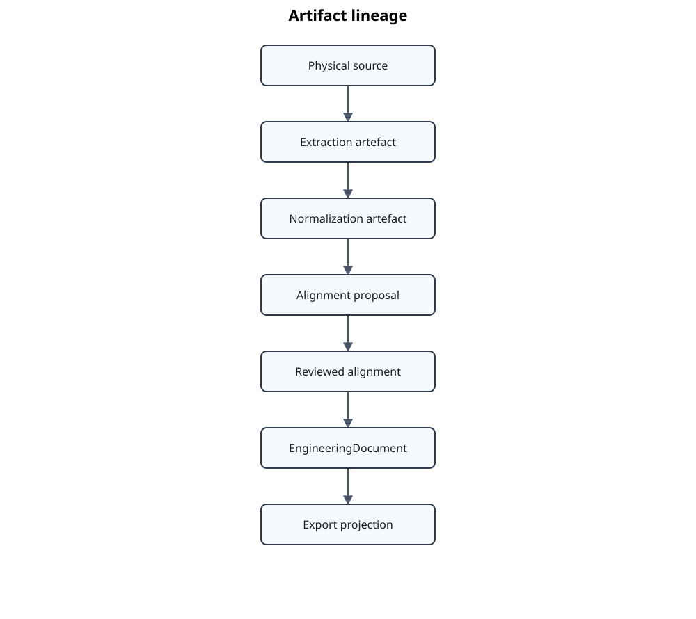

# Persistence and lineage



The diagram highlights lineage between major persisted stages. It does not show every review, report, cache, runtime-state, or renderer-specific artifact; the text defines their contracts and invalidation behavior.

The `.atlas/` workspace is a private implementation workspace, not a public interchange format. It persists typed stage contracts, runtime state, and derivation metadata. Published outputs belong below configured local or public roots according to copyright and visibility policy.

## Artifact chain

Typical persisted artifacts are source descriptors, Docling extraction, normalized documents, alignment proposals, reviewed alignments, construction contracts, engineering documents, Markdown exports, Doorstop exports, evaluation corpora, proposal runs, reviews, and qualification reports.

`ArtifactReference` combines artifact kind, canonical content hash, optional location, and media type. `ArtifactLineage` records direct predecessors and transformation identifiers. Deterministic hashes allow content identity to be separated from file modification time.

## Invalidation model

Invalidation follows semantic dependencies:

- source or page-selection change -> extraction and all descendants;
- extraction change -> normalization and all descendants;
- normalization or taxonomy change -> alignment, construction, exports, and affected corpora;
- AtlasData baseline change -> alignment and construction descendants;
- reviewed alignment change -> construction and exports;
- renderer change -> only the corresponding projection;
- prompt/model change -> proposal and qualification artifacts, not engineering documents.

## Review provenance

Machine proposals and human overrides remain distinct. Review imports preserve source proposal identity, reviewer decisions, and publication precedence. Published annotation data takes precedence over local review material, which in turn may take precedence over generated proposals according to the relevant repository contract.

## Privacy

Source paths, copyrighted text, local corpora, tokens, PID files, and audit logs must not leak into public documentation or generated public artifacts. Location fields in lineage are operational metadata and require the same visibility policy as their containing artifact.

## Governance and compliance lineage

Gemara and ComplyTime projections extend the artifact chain without becoming canonical state:

```text
EngineeringDocument
  -> GuidanceCatalog
  -> ControlCatalog
  -> ComplyTime governance bundle
  -> Gemara Policy / ComplyPack workspace
  -> EvaluationLog
  -> Standards Atlas feedback
```

Guidance and Control sidecars preserve clause-to-entry mappings and bind to exported YAML with
SHA-256. The ComplyTime bundle consolidates those mappings and hashes its component artifacts.
ComplyPack workspaces additionally hash evaluator policy content and generated configuration.
Evaluation feedback records hashes of both the EvaluationLog and governance manifest so a result
can be tied to the exact governance projection used for the assessment.

Use-case-specific selection is represented by profiles, candidate analyses, and Gemara Policy
imports/exclusions. The source catalogs remain stable rather than being copied into many filtered
variants.
