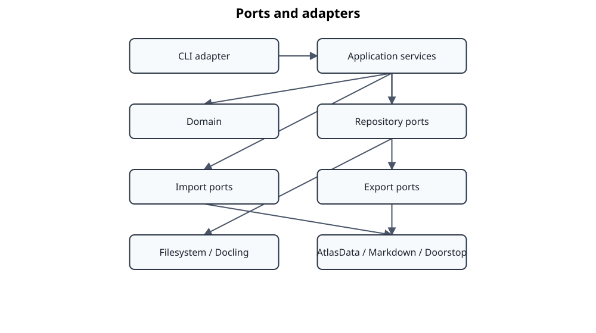

# Ports and adapters



This diagram explains the dependency rule and adapter direction. It is intentionally less detailed than the second page of the [current architecture class diagram](diagrams/svg/current-architecture-class-diagram.svg), which names representative services, protocols, and implementations. Neither view attempts to enumerate every repository or command-specific composition path.

## Dependency rule

Standards Atlas uses hexagonal architecture as an enforceable dependency rule, not only as a diagram.

```text
inbound adapter -> application use case -> domain
                         |
                         v
                    outbound port
                         ^
                         |
                  outbound adapter
```

The domain must not import application or adapters. Application code may depend on domain types and protocols declared in the application layer. Adapters may depend inward on both.

## Inbound side

The CLI maps arguments and configuration into application commands and services. It is also the primary composition root for repositories, converters, gateways, renderers, and runtime managers. MCP maps protocol requests into the transport-neutral `ClauseProvider` and `McpClauseService` boundary. Neither adapter owns business rules.

## Outbound ports

The application layer defines repositories and capabilities for, among other concerns:

- engineering documents and stage artifacts;
- extracted and normalized documents;
- alignment and review artifacts;
- construction contracts;
- prompt, dataset, corpus, annotation, and run persistence;
- document conversion and rendering;
- LLM completion;
- command execution and runtime health.

Ports should express application needs rather than mirror third-party APIs. The formula-visual adapter is deliberately narrow: it consumes adapter-neutral page/bounding-box evidence and does not perform formula discovery or semantic recognition.

## Adapter ownership

| Adapter package | External concern |
|---|---|
| `adapters/docling` | Primary PDF extraction, Docling contract validation, and composition with source-backed formula visuals |
| `adapters/pdf` | Deterministic source-PDF region rendering for already identified formula items |
| `adapters/filesystem` | Persistent application repositories |
| `adapters/atlasdata` | AtlasData import, lifecycle, and round-trip output |
| `adapters/markdown` | Document and review rendering |
| `adapters/doorstop` | Doorstop hierarchy and publication templates |
| `adapters/llm` | Codex CLI, OpenAI-compatible APIs, RamaLama process control |
| `adapters/mcp` | MCP protocol, HTTP security, process management, audit |

## Migration state

ADR 0053 established the current structural refactoring direction. Canonical implementations now live in focused packages such as `application/workflow`, `application/normalization`, `application/evaluation`, and `application/semantic_qualification`. Compatibility exports below `application/services` may remain for existing imports, but they are noncanonical. New code must import canonical packages and must not add concrete-adapter dependencies to reusable application services. Their eventual removal requires an explicit compatibility decision rather than being implied by the package refactoring.

Architecture tests should guard the dependency direction. Unit tests construct application services with test doubles; integration tests verify real adapter contracts and composition roots.
