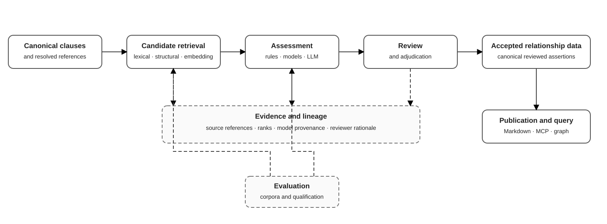

# Relationship-mapping target architecture



Relationship mapping identifies, assesses, reviews, and publishes evidence-backed relationships between clauses and engineering knowledge across standards, document families, and Knowledge Domains. It restores the useful intent of the legacy IntelliDoc prototype without adopting its framework choices or promoting model output directly into canonical data.

This document is a target architecture. The canonical clause model, reference resolution, structural profiles, evaluation services, LLM gateway, lineage contracts, and review patterns already exist. Retrieval, relationship assessment, adjudication, and graph publication are planned capabilities and must be introduced incrementally through the roadmap.

## Architectural outcomes

The target design must:

- represent relations independently from any vector store or LLM framework;
- preserve direction, relation type, evidence, provenance, confidence, and lifecycle;
- combine deterministic references, structural context, retrieval evidence, and model assessment;
- keep candidate generation separate from canonical acceptance;
- support cross-document and cross-domain relations;
- evaluate retrievers and assessors independently and end to end;
- expose accepted relations through Markdown, MCP, and formal semantic graph projections.

## Lifecycle

```text
source and canonical clauses
          |
          v
candidate retrieval ---- deterministic reference evidence
          |                         |
          +-----------+-------------+
                      v
             relationship assessment
                      |
                      v
              review / adjudication
                      |
                      v
            accepted relationship data
                      |
            +---------+---------+
            v                   v
      Markdown / MCP       formal semantic projection
```

The diagram is deliberately service-oriented. It does not enumerate every repository, evaluation report, model configuration, review file, or publication adapter. Those contracts are defined below and in the linked architecture documents.

## Canonical relationship concepts

A relationship is a reviewed domain assertion between stable subjects. Clause-to-clause relations are the initial case, but the model should permit future relations involving terms, methods, techniques, documents, and externally identified engineering objects.

A canonical relation requires at least:

- stable source and target identifiers;
- directionality;
- a controlled relation type;
- lifecycle state;
- supporting evidence references;
- provenance of proposal and acceptance;
- optional reviewer rationale and qualification metadata.

Confidence belongs to a proposal or assessment, not to truth itself. An accepted relation may retain the confidence of its generating assessments as evidence, but acceptance is a separate human or policy decision.

## Relation lifecycle states

| State | Meaning |
|---|---|
| Candidate | Retrieved or detected pair that has not been assessed |
| Proposed | One or more assessors produced a typed relationship proposal |
| In review | Candidate is part of an explicit adjudication set |
| Accepted | Canonical relation approved by a reviewer or qualified policy |
| Rejected | Reviewed candidate intentionally not promoted |
| Superseded | Previously accepted relation replaced by a newer decision |

Rejected candidates remain useful evaluation evidence and should not be silently discarded when storage policy permits retention.

## Evidence model

Evidence is additive and typed. Typical evidence includes:

- explicit resolved references in source content;
- shared definitions or identified terminology;
- structural proximity or analogous structural profiles;
- retrieval rank and embedding-model identity;
- reciprocal retrieval or neighborhood consistency;
- lexical or rule-based matches;
- constrained LLM assessment with prompt and model provenance;
- reviewer rationale;
- known relations imported from curated datasets.

Evidence records must point to immutable or versioned artifacts. Storing only a free-text explanation is insufficient for reproducibility.

## Application services and ports

The target application layer contains four independently testable capabilities.

### Candidate retrieval

`RelationshipCandidateRetriever` accepts a source object, search scope, and retrieval configuration. It returns ranked candidate identifiers and evidence without assigning a canonical relation type.

Outbound ports may include:

- clause and document search;
- embedding generation;
- vector-index access;
- lexical or structural retrieval;
- candidate-run persistence.

### Relationship assessment

`RelationshipAssessmentService` evaluates a bounded candidate pair. Assessors may be deterministic, statistical, or LLM-backed. Each assessment uses a versioned result schema and records assessor identity and parameters.

Assessment must not write accepted relations.

### Review and adjudication

`RelationshipReviewService` creates review sets, imports decisions, validates reviewer input, and produces accepted or rejected outcomes. Review artifacts should follow the existing local-data and reproducibility principles used for semantic annotation review.

### Publication and query

`RelationshipQueryService` reads accepted relations and authorized evidence. Exporters and inbound adapters determine which details are visible in Markdown, MCP, or a graph projection.

## Adapter boundaries

Likely outbound adapters include local embedding runtimes, vector stores, plain lexical indexes, graph traversal/query engines, GraphRAG-style retrievers, filesystem repositories, and LLM providers. These are replaceable implementations behind ports. No adapter-specific identifier may become the canonical relation identity.

Formal semantic projections are first-class derived representations, while concrete graph stores and retrieval frameworks remain replaceable adapters. GraphRAG is one possible implementation strategy behind a graph or hybrid candidate-retrieval port, not an architectural dependency.

## Evaluation strategy

Candidate retrieval and relationship assessment have different failure modes and must be measured separately.

Retrieval metrics should include recall at bounded candidate counts, reciprocal retrieval behavior, latency, and index size. Assessment metrics should include relation-type precision and recall, abstention quality, calibration, schema validity, and cost. End-to-end evaluation should measure accepted useful relations per review effort and false candidates presented to reviewers.

Evaluation corpora should include:

- explicit internal and cross-document references;
- known sibling and multipart relations;
- positive reviewed cross-domain mappings;
- hard negatives with similar terminology but different obligations;
- examples with insufficient evidence;
- superseded and disputed decisions where available.

Model consensus can propose review priorities, but it does not replace a qualified reference dataset.

## Security and copyright constraints

Retrieval indexes and prompts may encode protected clause content. They inherit the classification and storage requirements of their source artifacts. Remote assessment is prohibited unless deployment policy explicitly authorizes the content, endpoint, retention behavior, and credentials.

Public relation exports must not leak protected clause text through evidence snippets, generated rationales, embeddings, logs, or debug artifacts.

## Incremental implementation

1. Finalize relation and evidence value objects and persistence contracts.
2. Build a deterministic baseline from already resolved references.
3. Add a bounded local retrieval port and reproducible candidate runs.
4. Introduce review artifacts and accepted relation publication.
5. Qualify structure-aware and embedding-based retrieval variants.
6. Add constrained LLM assessment behind the existing LLM gateway.
7. Add MCP and Markdown relation navigation.
8. Qualify graph-assisted and hybrid retrieval implementations against the deterministic and embedding baselines.

## Related documentation

- [IntelliDoc refactoring roadmap](../roadmap/intellidoc-refactoring.md)
- [Legacy relationship-mapping prototype](../history/legacy-relationship-mapping.md)
- [Formal Semantic & Context Model](formal-semantic-context-model.md)
- [Domain model](domain-model.md)
- [Structural classification](structural-classification.md)
- [Evaluation services](evaluation-services.md)
- [LLM integration](llm-integration.md)
- [Security and copyright](security-and-copyright.md)
