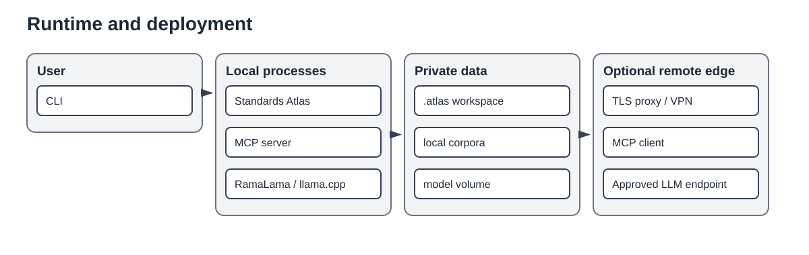

# Runtime and deployment

Standards Atlas is primarily a local CLI application with optional managed helper processes.

## Processes

- **CLI process** composes application services and performs most workflows synchronously.
- **RamaLama/llama.cpp process** is optional and serves local OpenAI-compatible inference.
- **MCP server process** is optional and exposes a read-only clause service through STDIO or Streamable HTTP.
- **Reverse proxy, VPN, or tunnel** may terminate TLS and enforce enterprise identity in front of remote MCP operation.

PID files, logs, leases, and health metadata are stored below `.atlas/runtime/`. Runtime managers must handle stale state, process-group termination, and externally terminated processes.

## Trust boundaries

The private workspace may contain copyrighted source-derived content. The MCP exposure configuration restricts documents, result sizes, returned text, hosts, origins, authentication, and audit behavior. Remote LLM endpoints form an additional trust boundary and require explicit approval.

## Deployment modes

1. **Local deterministic workflow**: no LLM and no MCP server.
2. **Local qualification workstation**: CLI plus managed RamaLama server using persistent model storage.
3. **Restricted Codex client**: local MCP server and Codex CLI with a narrow configuration profile.
4. **Remote MCP service**: Streamable HTTP behind controlled network and authentication infrastructure.

The application model and repositories remain the same in all modes; only composition and exposure policy change.
