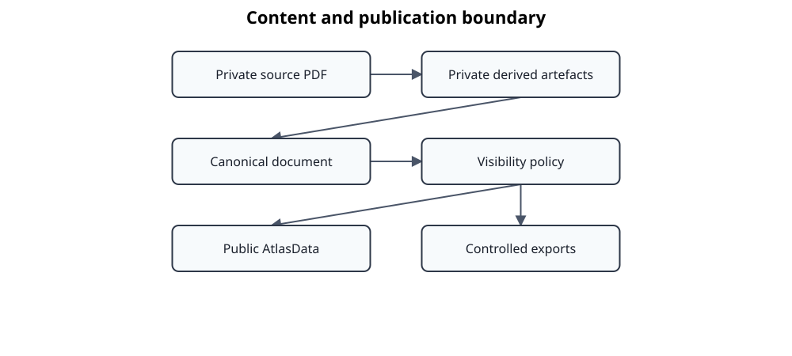

# Security and copyright boundaries

Standards Atlas processes documents that may be copyrighted, confidential, or operationally sensitive. Security is therefore built around content location, explicit trust boundaries, least-authorized adapters, reproducible provenance, and controlled publication.

The diagram shows the primary public/private content boundary. It intentionally omits individual runtime processes, credentials, network controls, model caches, temporary files, and backup systems; those are addressed in the asset and threat model below and in the deployment-specific guides.

## Assets

| Asset | Typical sensitivity | Required protection |
|---|---|---|
| Source PDFs and licensed publications | Protected or confidential | Local controlled storage; no unintended publication |
| Extracted and normalized clause text | Same as source | Inherit source classification and retention policy |
| Canonical documents containing source content | Protected or confidential | Access control, integrity, provenance, controlled export |
| Catalogs and structural metadata | Usually public or internal | Integrity, review, repository policy |
| Manual overrides and review decisions | Internal; may reveal content | Integrity, attribution, controlled storage |
| Evaluation corpora and reports | Often local/private | Content-safe reporting and qualified access |
| Prompts, model responses, embeddings, and indexes | May encode protected text | Same boundary as source-derived content |
| MCP credentials and service configuration | Secret or security-sensitive | Secret storage, rotation, least privilege |
| Audit and operational logs | May contain identifiers or excerpts | Minimize content, restrict access, define retention |
| Public Markdown, Doorstop, and reports | Publishable only after policy enforcement | Visibility filtering and publication review |

## Actors and trust assumptions

- **Local operator** controls source acquisition, workspace location, workflow execution, and publication decisions.
- **Reviewer** can inspect and approve alignment, annotations, or relationships within an authorized scope.
- **Maintainer** changes code, schemas, templates, and release artifacts.
- **Local model runtime** is trusted only to the extent of its process, container, mounted storage, and model provenance.
- **Remote model or MCP client** is outside the local trust boundary unless explicitly approved and configured.
- **Downstream consumer** receives only the projection authorized for that publication target.

No LLM, retriever, exporter, or MCP client is trusted to decide publication visibility by itself.

## Trust boundaries

### Source acquisition boundary

The operator is responsible for lawful acquisition and storage of source documents. Import does not imply permission to redistribute extracted content.

### Local processing boundary

Docling, normalization, construction, evaluation, embeddings, and review artifacts normally remain below `local/` or another configured private root. Temporary files, caches, and model volumes are part of this boundary even when they live outside the repository tree.

### Model boundary

Prompts and responses may disclose protected text. Remote inference requires explicit approval of endpoint, jurisdiction, retention, training-use policy, credentials, and transmitted fields. Local inference reduces network exposure but does not remove risks from logs, container mounts, model supply chain, or process isolation.

### MCP and network boundary

The MCP server exposes a controlled read interface, not raw filesystem access. Remote deployment requires authentication, allowed hosts and origins, request and result limits, audit logging, and transport protection. Content access remains constrained by workspace and service policy.

### Publication boundary

Exporters enforce visibility and target policy. Publication is an explicit transition from controlled content to a target audience, not a side effect of persistence. Generated output must be reviewed for protected clause text, evidence snippets, debug data, and accidental local paths.

## Principal threats and controls

| Threat | Example | Mandatory controls |
|---|---|---|
| Accidental publication | Generated Markdown includes protected text or private annotation | Explicit visibility, target policy, publication review, private roots |
| Unauthorized remote disclosure | Prompt sends clause content to an unapproved endpoint | Local-by-default inference, endpoint allow-listing, deployment approval |
| Path traversal or workspace escape | Crafted identifier accesses files outside configured roots | Canonical path validation, bounded repositories, no raw path tools |
| Prompt injection from source content | Clause text attempts to alter model instructions or invoke tools | Treat source as data, constrained schemas, tool separation, no automatic promotion |
| Malicious or malformed model output | Response corrupts canonical data | Schema validation, proposal lifecycle, qualification, human review |
| Denial of service | Oversized MCP request, result set, document, or model job | Request/body/result limits, bounded sampling, timeouts, resource controls |
| Credential leakage | Tokens appear in config, logs, or published archives | Environment/secret storage, redaction, rotation, packaging review |
| Supply-chain compromise | Untrusted model, Python package, container image, or template | Pinned dependencies, provenance review, controlled registries, release checks |
| Artifact tampering | Persisted intermediate or review file is changed unnoticed | Digests, lineage, deterministic identity, repository permissions |
| Stale artifact reuse | Old output is accepted after source or algorithm change | Contract versions, producer identity, invalidation and regeneration |
| Sensitive logging | Full clause text or prompts written to logs | Content-minimized structured logs and retention policy |
| Cross-tenant leakage | Shared service returns content from another workspace | Deployment isolation, scoped repositories, authentication and authorization |

## Copyright and visibility policy

Private PDFs, Docling JSON, normalized full text, alignment review material, and canonical documents containing source text remain local unless a controlled export permits them. AtlasData may contain metadata, structure, headings where permitted, types, and public annotations; it must not become an accidental copy of protected clause text.

Annotation visibility is explicit: `PUBLIC`, `LOCAL`, or `PRIVATE`. Relationship evidence and generated rationales require equivalent publication filtering because they may reproduce source meaning or text even when the relation itself is publishable.

Git ignore rules are a convenience, not a security boundary. Repository access, filesystem permissions, backups, synchronization tools, CI uploads, shell history, temporary directories, and archive creation must all respect the same content policy.

## Operational minimums

A network-accessible deployment must at minimum provide:

- authenticated access;
- encrypted transport at the deployment boundary;
- explicit allowed hosts and origins;
- bounded request size, result count, clause content, and runtime duration;
- private workspace isolation;
- content-minimized audit logs;
- credential rotation and incident procedures;
- review of model and external-service data handling.

## Verification expectations

Security-relevant behavior should be covered by tests for path containment, visibility filtering, authentication, request limits, invalid model output, and packaging exclusions. Release review must inspect distributions and change-only archives for local data, source publications, credentials, caches, and generated private reports.

## Related documentation

- [Runtime and deployment](runtime-and-deployment.md)
- [MCP clause server](mcp-clause-server.md)
- [LLM integration](llm-integration.md)
- [Persistence and lineage](persistence-and-lineage.md)
- [Evolution and compatibility](evolution-and-compatibility.md)
- [MCP server user guide](../user-guide/mcp-server.md)
- [Local LLM user guide](../user-guide/local-llm.md)
- [Release and versioning](../development/release-and-versioning.md)
