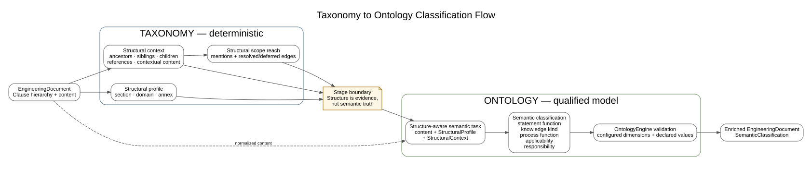

# Structural classification

Standards Atlas separates document structure from statement semantics.

## Structural profile

`StructuralProfile` is attached to each clause and contains independent taxonomy dimensions. Current dimensions include canonical document section, domain category, and annex status, with room for taxonomy identifiers and confidence or provenance metadata. The dimensions may be inferred from headings, hierarchy, document metadata, annex declarations, and domain-specific taxonomies.

This model implements ADR 0050 and replaces the former `Clause.semantic_roles` representation removed by ADR 0051. No compatibility field exists in the clause model.

## Taxonomy to ontology classification flow

The deterministic taxonomy stage enriches the normalized `EngineeringDocument` with
`StructuralProfile`, `StructuralContext`, reference edges, and structural scope reach. These
values form explicit evidence for the subsequent ontology stage. They never directly assign
semantic statement, knowledge, process, applicability, or responsibility functions. The
ontology classifier consumes normalized content together with the materialized structural
evidence. `OntologyEngine` validates the emitted dimensions and values against the versioned
ontology profile before `OntologyClassificationService` persists them as
`SemanticClassification`.

The stage boundary is deliberate: taxonomy answers where a clause is located and how
structural statements reach other clauses; ontology answers what the clause means in the
engineering knowledge model.

## Why dimensions are independent

A one-dimensional role cannot faithfully represent that a clause is simultaneously:

- located in a scope or requirements section;
- normative or informative through document/annex context;
- associated with verification, management, development, or another domain category;
- a note, example, definition, requirement, or permission at statement level.

Structural classification therefore answers *where the clause belongs in the document and domain framework*. Semantic classification answers *what its statements do*.

## Taxonomy resources and deterministic engine

Versioned structure taxonomies live below `resources/structure-taxonomies/`, separated into document-level and domain-level definitions. Functional-safety taxonomies may specialize general ISO/IEC document structure without being imposed on railway TSI, Polarion, cybersecurity, or other knowledge domains.

The YAML file is the versioned category contract; classification behaviour is supplied by a `StructuralTaxonomyClassifier` implementation. `StructuralTaxonomyRegistry` resolves those implementations by taxonomy id and version, and `StructuralTaxonomyEngine` composes explicitly selected document/domain classifiers with the generic `StructuralProfileClassifier`. Emitted categories are checked against the corresponding YAML definition.

This layer is deterministic and LLM-free. Complex tree algorithms remain normal Python code rather than being encoded in a general-purpose YAML rule language. Semantic LLM tasks are a separate concern. The current built-in implementation moves ISO/IEC Directives Part 2 classification out of the AtlasData adapter; Railway TSI, Polarion, Functional Safety, and Cybersecurity can provide independent classifiers through the same interface.

## Inheritance

Defaults and inheritance are explicit normalization rules. Core normative sections may inherit normative status; annex declarations determine annex status; notes, examples, and guidance remain informative even inside a normative parent where the governing standard requires that distinction. Whole informative parts can define a document-level default.

## Evaluation

Qualification corpora must evaluate each dimension independently and report coverage and confusion per dimension. Proposal interfaces should include insufficient-evidence outcomes instead of forcing a category. Structural evidence may be supplied to a structure-aware prompt, while content-only candidates provide a useful baseline.
