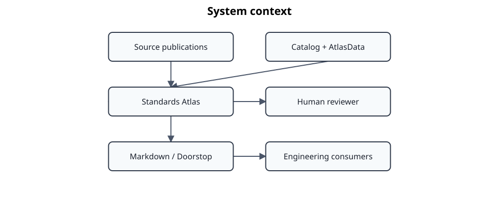

# System context

Standards Atlas sits between controlled technical publications and downstream automated engineering processes. It captures standards, technical specifications, and other strongly structured technical texts as canonical **EngineeringDocuments** and enriches them so that both document structure and engineering meaning can be consumed by machines without losing provenance.

Inputs include private source publications, public AtlasData baselines, catalogs, Knowledge Domain configuration, domain-specific OWL TBoxes, and human review decisions. Deterministic processing first captures document structure and taxonomy. Qualified LLM-assisted processing then identifies abstract semantic functions and domain knowledge. Taxonomy, semantic context, structural position, provenance, and qualification evidence form the Standards Atlas context layer (CBox); domain TBoxes provide the formal vocabulary from which clause-level ABox assertions are derived.

The resulting knowledge can be projected into Markdown or Doorstop, embedded into RAG and GraphRAG structures, analyzed across documents and domains, or exposed to interactive chat and MCP clients. These are downstream views and access paths: `EngineeringDocument` remains the canonical document representation, while OWL projections and retrieval indexes are rebuildable derived artifacts.

Source publications remain authoritative and protected according to their licensing constraints. Every generated artifact retains links to its origin, transformation history, and qualification or review evidence.

The context diagram identifies actors, external systems, and protected-content boundaries. Internal application services and repositories are intentionally delegated to the component, class, pipeline, and deployment views.
