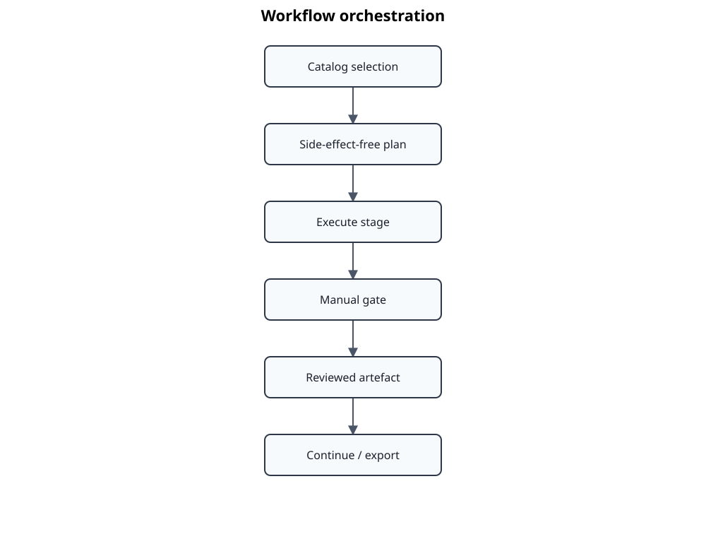

# Workflow orchestration

The diagram focuses on planner, executor, recovery, reporting, and manual gates. Individual services invoked by the executor, CLI option mapping, runtime leases, and every persisted workflow artifact are described in text rather than shown as separate UML elements.

The workflow subsystem is split into planning, execution, recovery, and reporting.

## Planner

`WorkflowPlanner` resolves catalog intent into an ordered `WorkflowPlan`. Planning is side-effect free. It determines required stages, existing artifacts, replacement policy, manual gates, and selected publication targets. Exactly one document-family selection mode is used for a run.

## Executor

`WorkflowExecutor` executes the plan by invoking focused application services. It does not contain extraction, normalization, alignment, or rendering algorithms. It records stage outcomes and stops at unresolved manual gates. Runtime resources such as a managed local LLM server are acquired only by operations that need them and must be released reliably.

## Recovery

`WorkflowRecovery` inspects incomplete or inconsistent workspace state and derives repair actions. `--overwrite`, `--force`, and stage-specific retention options are explicit user policies; they are not interchangeable. Recovery should prefer the smallest safe invalidation set.

## Reporting

Derivation reports make decisions observable: why a stage ran, why it was reused, which predecessor invalidated it, and where review is required. This report is part of the workflow contract and supports reproducibility and troubleshooting.

## Manual gates

- alignment review;
- generated AtlasData baseline review;
- optional annotation or golden-corpus review;
- future relationship adjudication.

`--continue-after-review` is valid only when the expected reviewed artifact exists and passes its contract.
