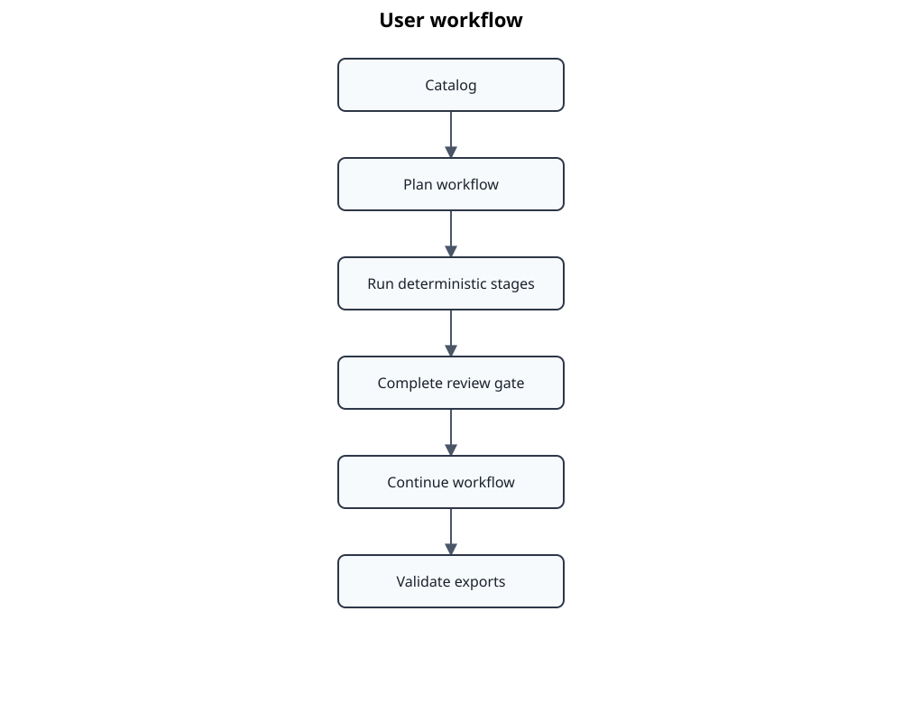

# User guide

The user guide follows the lifecycle of a standard from catalog entry and private source document to reviewed, composed, and exported engineering artefacts.

## Start here

| Task | Document |
|---|---|
| Install and execute a first workflow | [Getting started](getting-started.md) |
| Learn the vocabulary and object lifecycle | [Core concepts](concepts.md) |
| Configure standards, editions, parts, and page selection | [Catalogs and profiles](catalogs-and-profiles.md) |
| Run individual pipeline stages or the end-to-end workflow | [Document workflow](document-workflow.md) |

## Review and governance

| Task | Document |
|---|---|
| Review automatic clause alignment and record overrides | [Alignment review](alignment-review.md) |
| Manage proposed, reviewed, and published structural baselines | [AtlasData lifecycle](atlasdata-lifecycle.md) |
| Compose standards with multiple parts and annexes | [Multi-part standards](multipart-standards.md) |

## Outputs and operations

| Task | Document |
|---|---|
| Export Markdown or Doorstop artefacts | [Exports](exports.md) |
| Understand `.atlas`, `data`, and generated output | [Workspace](workspace.md) |
| Diagnose common command and data problems | [Troubleshooting](troubleshooting.md) |
| Build local corpora and benchmark prompts/models | [Evaluation workflow](evaluation-workflow.md) |

## Related material

- [CLI reference](../reference/cli-reference.md)
- [Catalog format reference](../reference/catalog-format.md)
- [Architecture overview](../architecture/README.md)
- [Documentation home](../README.md)
