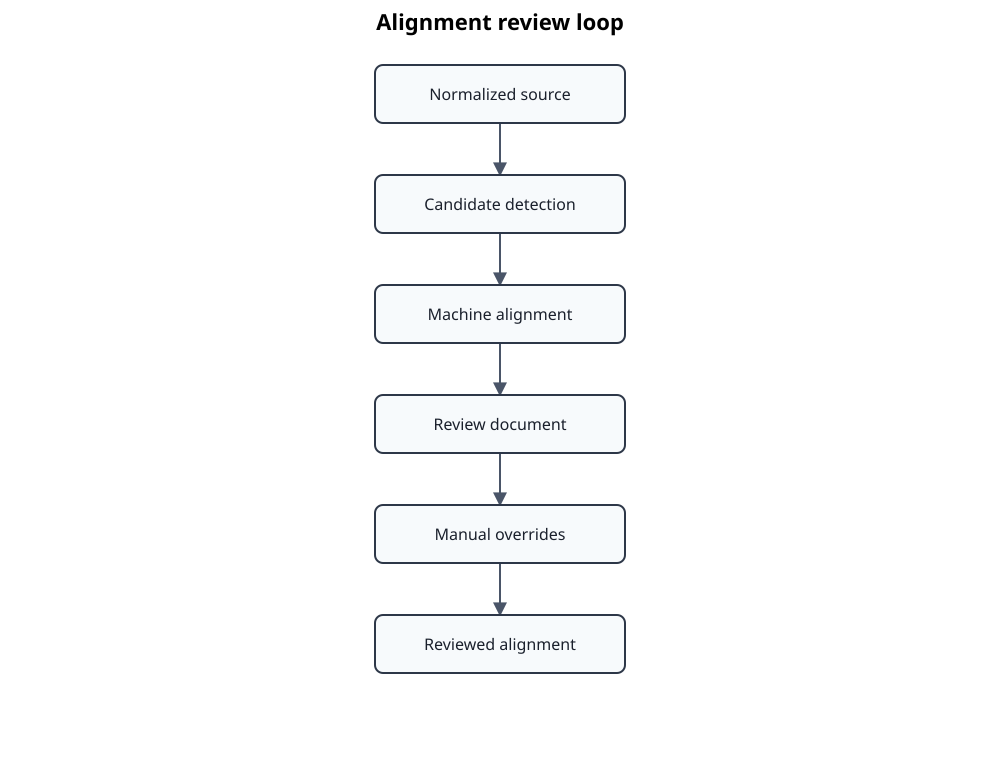

# Alignment review

Automatic alignment is a proposal, not an approval.



## Generate a review

```bash
uv run standards-atlas align review-export EN50716
```

The full-document review keeps source context around each candidate. Secure mappings are rendered plainly; uncertain mappings are marked so reviewers can distinguish machine confidence from approved structure.

## Validate and compare

```bash
uv run standards-atlas align review-validate EN50716
uv run standards-atlas align review-diff EN50716
```

Validation checks syntax and completeness. Diffing isolates reviewer changes from regenerated machine proposals.

## Import and apply

```bash
uv run standards-atlas align review-import EN50716
uv run standards-atlas align validate-overrides EN50716
uv run standards-atlas align review-apply EN50716
```

Overrides are explicit, versionable decisions. Applying them produces a reviewed alignment artefact while retaining the original proposal and transformation history.

Reviewers should resolve missing clauses, incorrect part assignment, annex handling, split or merged headings, and ambiguous source ranges before downstream publication.
