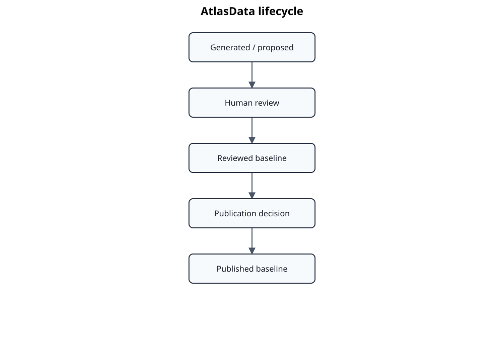

# AtlasData lifecycle

AtlasData is governed as a reviewed public baseline.



Typical states are `proposed`, `reviewed`, and `published`. A reviewed baseline is valid for controlled downstream processing; publication marks a baseline intended for public exchange. Status transitions are explicit:

```bash
uv run standards-atlas atlasdata set-status data/EN50716 reviewed
```

Generate or refresh structural TOC data with:

```bash
uv run standards-atlas atlasdata generate-toc data/EN50716
```

Docling headings can create a skeleton for a new baseline:

```bash
uv run standards-atlas atlasdata onboard-docling EN50716 data/EN50716
```

For multi-part families use `onboard-docling-parts`. Generated headings and types must be reviewed; copyright-protected clause text must not be copied into public AtlasData fields.
