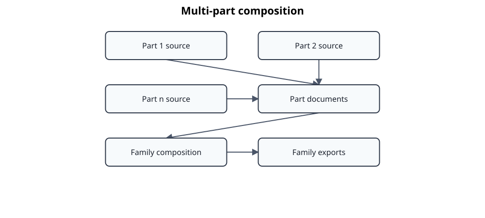

# Multi-part standards

A standard family may be extracted from several PDFs while keeping each physical part as the only canonical EngineeringDocument. Publication uses a rebuildable composed family view.



Each part retains its physical source provenance and has exactly one clause `0` root in the canonical representation. Part identifiers are distinct from publication years. Annexes remain addressable and are reported separately during alignment.

Useful commands include:

```bash
uv run standards-atlas document derive-part FAMILY PART
uv run standards-atlas document compose-family FAMILY
uv run standards-atlas atlasdata onboard-docling-parts FAMILY DATA_PATH
```

Composition validates part identity, root structure, and key uniqueness. It writes `.atlas/work/composed-documents/<family>.json`, never `.atlas/data/documents/<family>.json`. Markdown export can emit separate files for all parts in one invocation; Doorstop export creates a root item for each part.
