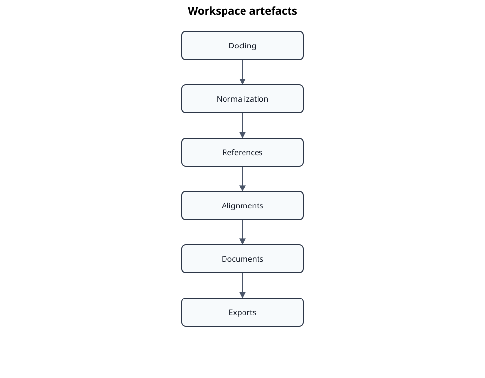

# Workspace

The `.atlas/` directory contains local and derived artefacts.

Common locations include:

- `.atlas/docling/<key>/`: native Docling output and conversion metadata
- `.atlas/normalization/<key>/`: normalized artefacts and transformation evidence
- `.atlas/references/<key>/`: detected reference candidates
- `.atlas/alignments/<key>/`: proposals, reviews, overrides, and reviewed alignments
- `.atlas/documents/<key>.json`: canonical engineering documents
- `.atlas/doorstop/`: generated Doorstop workspaces where configured

The workspace is reproducible only to the degree that source files, catalog versions, tool versions, options, and review decisions are retained. Do not commit private source-derived artefacts by default. Public AtlasData and documentation belong outside `.atlas/`.
